# SprintGuard AI — Solution Architecture

Status: Draft v2.0 · Owner: Platform Architecture · Last updated: 2026-07-21

## 1. Executive Summary

SprintGuard AI is a multi-tenant, AI-first, **agentic** SaaS platform that ingests sprint artifacts
(stories, requirements, acceptance criteria, documents), applies a coordinated fleet of specialized
AI agents to analyze, generate, and reason over that content, detects coverage gaps and risk, scores
release readiness, and surfaces sprint intelligence to QA, Product, and Engineering stakeholders —
with full governance, explainability, and cost control over every AI decision.

The architecture is built around the following non-negotiable principles (expanded in §2):

1. **Domain-Driven Design (DDD)** — the system is decomposed into bounded contexts that mirror the
   business domain (Sprint Intelligence, Requirement Intelligence, Test Intelligence, Coverage &
   Risk, Release Governance, Agent Framework, Knowledge Intelligence, AI Governance, AI Operations,
   Integration Hub, Identity & Tenancy, Platform).
2. **Clean Architecture** — every bounded context is internally layered
   (Presentation → Application → Domain → Infrastructure) with dependencies pointing inward only.
   The Domain layer has zero framework dependencies.
3. **SOLID** — enforced at the module boundary via interfaces/ports (e.g. `IAiProvider`,
   `IIntegrationProvider`, `ITestGenerationStrategy`, `IAgent`, `IAgentTool`) so implementations are
   swappable without touching consumers.
4. **Event-Driven Architecture, event-first** — cross-context workflows are modeled as domain
   events over a durable queue (BullMQ/Redis) and, where consumer-facing immediacy matters, streamed
   in real time over WebSockets/SSE — never synchronous call chains.
5. **AI-first, provider-agnostic, agentic** — all AI capability is delivered by specialized,
   governed **Agents** orchestrated by an Agent Framework, each agent invoking pluggable LLM
   providers (Claude, OpenAI, Gemini) through a single `IAiProvider` port. Prompts are versioned and
   governed, outputs are JSON-schema validated, every AI decision is scored for confidence, logged
   for audit/explainability, and cost-optimized via caching and model routing.
6. **Knowledge-centric** — all domain entities (stories, requirements, ACs, test cases, defects,
   releases) are linked in a Knowledge Graph with semantic/vector retrieval, so agents reason over
   *related* context, not isolated records.
7. **Cloud-native, observability-first, extensibility-first** — every service is stateless,
   container-native, instrumented end-to-end (§26), and built to be extended by first-party and
   third-party plugins (§22) without modifying core code.

This document defines the system context, container topology, bounded contexts, layering rules,
multi-tenancy model, event/real-time architecture, agentic AI architecture (agents, memory,
knowledge, governance, operations, cost), integration hub, API architecture, document intelligence,
SaaS platform features, plugin/workflow extensibility, security model, observability, and deployment
topology. Database schema is covered in [02-database-design.md](02-database-design.md).

---

## 2. Architecture Principles

| Principle | What it means for SprintGuard AI |
|---|---|
| Domain-Driven Design | Bounded contexts (§6) mirror the business domain; ubiquitous language shared across code, docs, and prompts |
| Clean Architecture | Presentation → Application → Domain → Infrastructure, dependencies point inward only (§7) |
| SOLID | Every cross-cutting capability (AI provider, integration, agent, tool, workflow step) is a port + swappable adapter |
| Event-First Design | State changes are modeled as domain/integration events first; synchronous request/response is the exception, used only for user-facing reads/writes that must be immediate |
| Agentic AI | AI capability is delivered by autonomous, specialized Agents with defined responsibilities, memory, and tools — not a monolithic "call the LLM" service (§10) |
| Knowledge-Centric AI | Agents reason over a connected Knowledge Graph + semantic retrieval layer, not isolated rows (§12) |
| AI Governance & Responsible AI | Every prompt, model, and AI decision is versioned, approved, auditable, and explainable (§13) |
| Observability-First | Nothing ships without traces/metrics/logs/AI-operational telemetry from day one (§26, §14) |
| Cloud-Native | 12-factor, stateless, container/K8s-ready, horizontally scalable (§27) |
| Extensibility-First / Platform Engineering | Plugin Framework (§22) and Workflow Engine (§23) let capability be added without core-code changes, treating SprintGuard itself as a platform other teams build on |
| Developer Experience | Typed contracts end-to-end (Prisma → NestJS DTOs → Zod → TanStack Query), OpenAPI/GraphQL schema generation, seed data, one-command local bootstrap (Docker Compose) |
| Multi-Tenancy & Tenant Isolation | Shared-schema, row-level isolation + Postgres RLS, reinforced by Feature Management scoping (§17) and Credential Vault scoping (§18) |

---

## 3. Architecture Style

| Concern | Approach |
|---|---|
| Macro style | **Modular Monolith, microservice-ready.** Each bounded context is a NestJS module with its own Domain/Application/Infrastructure layers and its own Prisma schema namespace. Modules communicate only via defined ports (interfaces) or domain events — never by reaching into another module's repositories directly. This lets any module (Agent Framework, Knowledge Intelligence, Integration Hub, Document Intelligence) be extracted into its own deployable service later with no consumer-side changes. |
| Read/Write | **CQRS-ready.** Command handlers (writes) and Query handlers (reads) are separated per module using NestJS `CqrsModule` conventions today; a dedicated read-model/projection store can be introduced later without changing the command side. |
| Cross-module workflows | **Event-driven, event-first.** Domain events (`SprintImportedEvent`, `StoryAnalyzedEvent`, `TestScenariosGeneratedEvent`, `CoverageComputedEvent`, `ReleaseReadinessComputedEvent`, agent lifecycle events) are published to an in-process event bus (`@nestjs/cqrs` EventBus) and mirrored to BullMQ for durable, retryable, cross-process execution, with a real-time fan-out layer (§9.4) streaming progress to connected clients. |
| Agentic execution | **Multi-agent, orchestrated.** AI work is performed by specialized Agents (§10) run by an Agent Runtime, coordinated by an Agent Orchestrator, invoked either synchronously (chat-style, low-latency) or asynchronously (pipeline stages via BullMQ). |
| API style | REST (OpenAPI/Swagger) + GraphQL-ready + WebSockets/SSE for streaming + Webhook APIs — full breakdown in §19. |
| Multi-tenancy | Shared database, shared schema, **row-level isolation** via mandatory `organizationId` on every tenant-scoped table + Postgres Row-Level Security (RLS) policies as defense-in-depth beneath the application-level tenant guard. |
| Extensibility | Plugin Framework (§22) + Workflow Engine (§23) allow new agents, tools, integrations, and pipelines to be registered without core redeploys. |

---

## 4. C4 — System Context Diagram

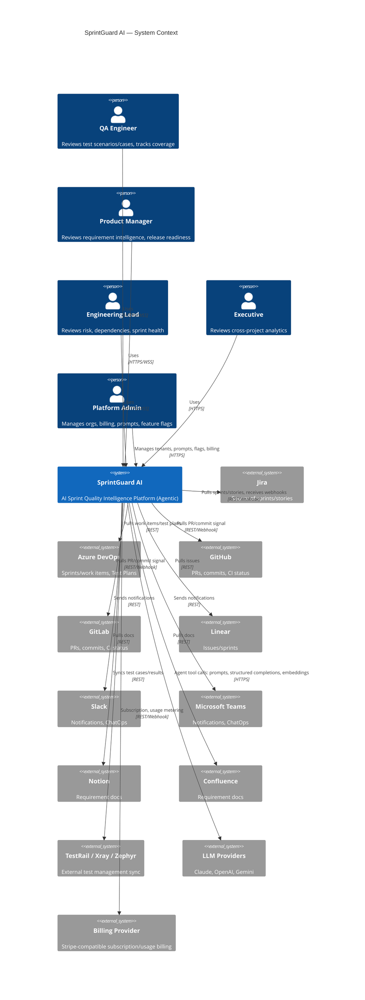

---

## 5. C4 — Container Diagram

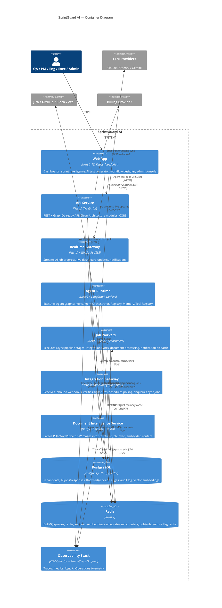

---

## 6. Bounded Contexts (DDD Domain Map)

| Bounded Context | Responsibility | Core Aggregates | Owning Module |
|---|---|---|---|
| **Identity & Tenancy** | Auth, users, organizations, roles/permissions, JWT/OAuth, API keys | `User`, `Organization`, `Role`, `Membership`, `ApiKey` | `iam` |
| **Project & Sprint** | Projects, sprints, sprint lifecycle, sprint health | `Project`, `Sprint` | `sprint` |
| **Requirement Intelligence** | Stories, requirements, acceptance criteria extraction, dependency/risk detection | `Story`, `Requirement`, `AcceptanceCriterion` | `requirement-intelligence` |
| **Test Intelligence** | AI test scenario/case generation, test authoring, regression recommendation | `TestScenario`, `TestCase` | `test-intelligence` |
| **Coverage & Risk** | Coverage matrix computation, gap analysis, sprint risk scoring | `CoverageMatrixEntry`, `RiskAssessment` | `coverage` |
| **Execution** | Test execution tracking (MVP: manual result capture; future: CI/CD + TestRail/Xray/Zephyr ingestion) | `Execution` | `execution` |
| **Release Governance** | Release readiness scoring, executive summaries | `ReleaseReport` | `release` |
| **Defect Intelligence** *(Phase 2)* | Defect clustering, root-cause signal | `Defect` | `defect` (stub) |
| **Agent Framework** *(new)* | Multi-agent orchestration: registry, runtime, memory, tool registry, communication, lifecycle | `Agent`, `AgentRun`, `AgentMessage`, `AgentTool` | `agents` |
| **AI Orchestration** | Provider abstraction, prompt templates/versioning, LangGraph workflows, evaluation, confidence scoring | `AiPrompt`, `AiJob`, `AiResponse` | `ai` |
| **AI Governance** *(new)* | Prompt/model approval workflow, model registry/routing, guardrails, compliance/decision audit | `PromptApproval`, `ModelRegistryEntry`, `GuardrailPolicy`, `AiDecisionAudit` | `ai-governance` |
| **AI Operations** *(new)* | Token/cost/latency/provider/model/agent monitoring, hallucination & acceptance tracking, benchmarking | `AiUsageMetric`, `AiIncident`, `Benchmark` | `ai-ops` |
| **Knowledge Intelligence** *(new)* | Knowledge graph, semantic/vector search, embeddings, ontology, relationship engine | `KnowledgeNode`, `KnowledgeEdge`, `EmbeddingRecord` | `knowledge` |
| **Document Intelligence** *(new)* | Parsing (PDF/Word/Excel/CSV/OCR), classification, chunking, PII detection | `DocumentAsset`, `DocumentChunk` | `documents` |
| **Integration Hub** *(replaces Integration)* | Connector SDK, webhook/polling engines, credential vault, transformation layer | `IntegrationConnection`, `Connector`, `WebhookEvent`, `SyncJob` | `integration` |
| **Feature Management** *(new)* | Feature flags, rollout %, A/B tests, canary releases, remote config | `FeatureFlag`, `Rollout`, `Experiment` | `feature-management` |
| **Plugin Framework** *(new)* | Plugin registry, extension SDK for AI/integration/prompt/agent/workflow plugins | `Plugin`, `PluginInstallation` | `plugins` |
| **Workflow Engine** *(new)* | Visual workflow designer/runtime for AI + test pipelines | `WorkflowDefinition`, `WorkflowRun` | `workflows` |
| **Realtime & Notification** *(expanded Platform)* | WebSocket/SSE gateway, notification hub, live progress/dashboard streaming | `NotificationEvent`, `StreamSubscription` | `realtime` |
| **SaaS Platform** *(new)* | Subscription/billing, onboarding, workspace provisioning, usage quotas, white-label/branding, customer portal | `Subscription`, `UsageQuota`, `TenantBranding` | `platform-saas` |
| **Platform / Audit** | Audit logging, audit center | `AuditLog` | `platform` |

Each bounded context maps 1:1 to a NestJS module (`apps/api/src/modules/<context>`) with its own
Domain, Application, Infrastructure sub-layers, and — critically — its own Prisma models grouped
in the shared schema but never queried across module boundaries except through the module's public
Application-layer services.

---

## 7. Clean Architecture — Layering Rules

Applied per bounded context module:

```
modules/<context>/
├── presentation/        # Controllers, GraphQL resolvers, WS gateways, DTOs, guards, pipes
├── application/          # Use cases (Commands/Queries + Handlers), Application services, ports (interfaces)
├── domain/                # Entities, Value Objects, Domain Events, Domain Services, Repository interfaces
└── infrastructure/       # Prisma repositories (implement domain repo interfaces), external clients, mappers
```

**Dependency rule:** `presentation → application → domain ← infrastructure`. Domain never imports
from application/presentation/infrastructure. Infrastructure implements interfaces declared in
Domain (`IStoryRepository`) or Application (`IAiProvider`, `IAgent`, `IAgentTool`,
`IIntegrationProvider`) — Dependency Inversion in practice, wired via NestJS DI tokens in each
module's `*.module.ts`.

**Concretely:**
- Domain entities are plain TypeScript classes with invariants enforced in constructors/methods —
  no decorators, no Prisma types leaking in.
- Application layer defines Commands/Queries (CQRS) and orchestrates Domain + ports. This is where
  transactions and domain event publication happen.
- Infrastructure implements repository interfaces using Prisma, implements `IAiProvider` per LLM
  vendor, implements `IIntegrationProvider` per external system, implements `IAgentTool` per
  callable capability an agent may invoke.
- Presentation layer only depends on Application — controllers/resolvers/gateways call use case
  handlers, never repositories or Prisma directly.

This is enforced structurally (module boundaries + TS path aliases) and is the basis for the
Backend Folder Structure artifact (Step 3, next in sequence).

---

## 8. Multi-Tenancy Strategy

- **Model:** Shared DB, shared schema, discriminator column `organizationId` (UUID) on every
  tenant-scoped table.
- **Application-level enforcement:** a `TenantContext` (AsyncLocalStorage-backed, populated by
  `TenantMiddleware` from the JWT's `orgId` claim) is injected into every repository call; a base
  `TenantScopedRepository` automatically adds `WHERE organizationId = :tenantId` to all Prisma
  queries — impossible to forget per-query.
- **Defense in depth:** PostgreSQL Row-Level Security (RLS) policies on tenant tables, keyed off a
  session variable (`SET app.current_org_id`) set per request via a Prisma middleware/`$extends`
  hook. Even a bug in application code cannot leak cross-tenant rows.
- **Tenant admin isolation:** platform-level super-admin role bypasses RLS via a separate DB role
  used only by the admin module, never the general app pool.
- **Feature/flag scoping:** Feature Management (§17) resolves flags per-organization so tenant
  isolation extends to *capability* exposure, not just data.
- **Credential scoping:** Integration Hub's Credential Vault (§18) encrypts and scopes third-party
  OAuth tokens per organization, never shared across tenants.

---

## 9. Event-Driven Architecture

### 9.1 Domain Events (in-process, `@nestjs/cqrs` EventBus)
Used for same-transaction-boundary side effects (e.g. updating a read model after a command
commits).

### 9.2 Integration Events (durable, BullMQ over Redis)
Used for cross-module, potentially long-running, retryable work:

| Event | Producer | Consumer(s) | Queue |
|---|---|---|---|
| `sprint.imported` | Sprint module | Sprint Analyst Agent | `ai.story-analysis` |
| `story.analyzed` | Requirement Intelligence Agent | Test Scenario Agent | `ai.scenario-generation` |
| `scenarios.generated` | Test Scenario Agent | Test Case Agent, Coverage Guardian Agent | `ai.case-generation`, `coverage.recompute` |
| `coverage.computed` | Coverage Guardian Agent | Release Guardian Agent | `release.recompute` |
| `release.computed` | Release Guardian Agent | Realtime/Notification Hub | `notifications.dispatch` |
| `document.uploaded` | Document Intelligence | Chunking/Embedding pipeline, Knowledge Intelligence | `documents.process` |
| `integration.webhook.received` | Integration Hub Gateway | Sprint/Story sync handlers | `integration.sync` |
| `agent.run.started` / `agent.run.completed` / `agent.run.failed` | Agent Runtime | AI Operations, Realtime Hub | `agent.lifecycle` |
| `workflow.run.started` / `workflow.run.completed` | Workflow Engine | Realtime Hub, AI Operations | `workflow.lifecycle` |

**Reliability pattern:** Transactional Outbox — domain writes and the corresponding outbox row are
committed in the same DB transaction; a relay process publishes outbox rows to BullMQ, guaranteeing
at-least-once delivery even across process crashes. Consumers are idempotent (dedupe key = event
id) to make at-least-once safe.

### 9.3 Sequence Diagram — Sprint Import → Release Readiness (end-to-end agentic pipeline)

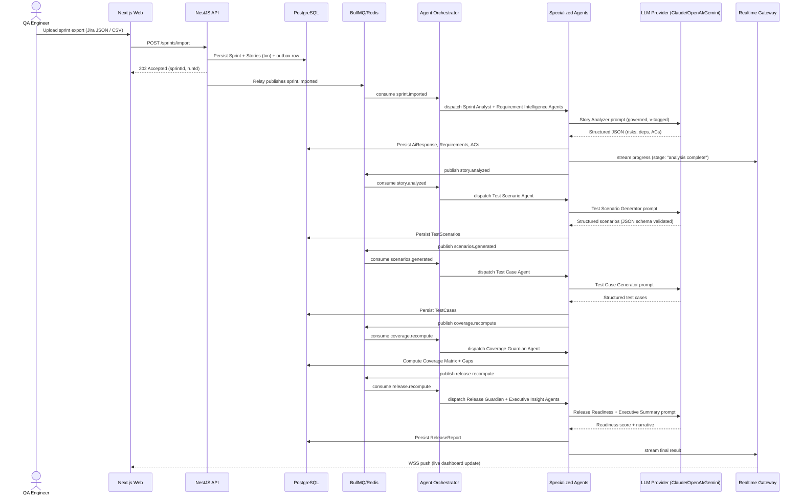

### 9.4 Real-Time Architecture

SprintGuard treats real-time delivery as a first-class concern, not a bolt-on:

| Mechanism | Use case |
|---|---|
| **WebSockets** (Realtime Gateway, `@nestjs/websockets` + Redis adapter for multi-pod fan-out) | Bi-directional: live AI job progress, collaborative prompt editing, live dashboard refresh |
| **Server-Sent Events (SSE)** | One-way streaming for long-running AI generations (token/stage streaming to the AI Test Generator UI) where a full duplex channel isn't needed |
| **Event Streaming (Redis Pub/Sub, upgrade path to Kafka/Redpanda at scale)** | Fan-out of `agent.run.*`, `workflow.run.*`, and domain events to any number of subscribed dashboard sessions without re-querying the DB |
| **Notification Hub** | Central dispatcher that turns integration events into user-facing notifications (in-app, Slack, Teams, email) with per-user/org preference resolution |
| **Progress Updates / AI Job Streaming** | Every `AgentRun`/`WorkflowRun` emits stage-level progress events consumable by the Realtime Gateway, so the frontend shows granular pipeline status rather than a spinner |

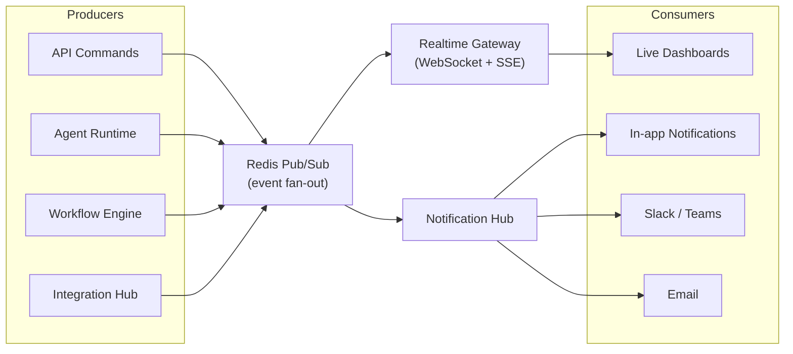

---

## 10. Agent Framework (Multi-Agent Architecture)

The AI Orchestration Service from v1.0 is elevated into a full **Agent Framework** bounded context.
Rather than a single service issuing LLM calls, SprintGuard runs a fleet of specialized,
single-responsibility agents coordinated by an orchestrator — each independently testable,
independently promotable (via AI Governance, §13), and independently benchmarked (via AI
Operations, §14).

### 10.1 Agent Framework Building Blocks

| Component | Responsibility |
|---|---|
| **Agent Orchestrator** | Resolves which agent(s) handle an incoming event/command, sequences multi-agent pipelines (via LangGraph `StateGraph`), handles hand-off between agents |
| **Agent Registry** | Central catalog of installed agents (built-in + plugin-provided), their versions, and enablement per organization (integrates with Feature Management) |
| **Agent Runtime** | Executes an agent's LangGraph graph: loads memory, invokes tools/providers, validates output, persists results |
| **Agent Memory** | Read/write interface into the AI Memory Architecture (§11), scoped per agent/run |
| **Agent Tool Registry** | Catalog of `IAgentTool` implementations an agent may call (e.g. `QueryKnowledgeGraphTool`, `FetchJiraStoryTool`, `RunCoverageQueryTool`) — agents declare which tools they're permitted to use |
| **Agent Communication** | Structured message-passing between agents in a pipeline (`AgentMessage`: from, to, intent, payload, correlationId) — avoids ad-hoc shared state |
| **Agent Execution Engine** | Wraps every agent invocation with retry policy, circuit breaker, timeout, confidence scoring, and cost metering (shared with §14/§15) |
| **Agent Lifecycle** | States: `Registered → Enabled → Running → Succeeded/Failed/Retrying → Deprecated`; lifecycle transitions emit `agent.run.*` events |
| **Agent Capability Registry** | Declares what each agent *can* do (capability tags) so the Orchestrator and Workflow Engine (§23) can compose pipelines declaratively rather than via hardcoded sequences |

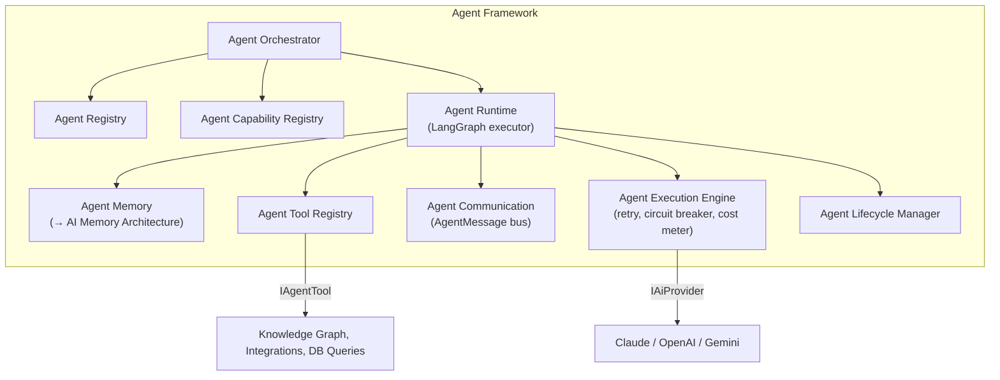

### 10.2 Specialized Agents

| Agent | Responsibility | Inputs → Outputs | Events Produced / Consumed | Shared Memory | Tools | Provider Selection | Failure & Retry |
|---|---|---|---|---|---|---|---|
| **Sprint Analyst Agent** | Assesses overall sprint health, load, and velocity risk | Sprint + Stories → `SprintHealthScore` | Produces `sprint.health.computed`; Consumes `sprint.imported` | Sprint Memory, Org Memory | `QuerySprintHistoryTool` | Default org model; fast/cheap tier | 3x retry w/ backoff; falls back to heuristic scoring on repeated failure |
| **Requirement Intelligence Agent** | Extracts/normalizes requirements from stories & docs | Story/Document → `Requirement[]` | Produces `requirement.extracted`; Consumes `sprint.imported`, `document.processed` | Project Memory, Knowledge Memory | `QueryKnowledgeGraphTool`, `DocumentChunkTool` | Reasoning-tier model | Repair-prompt on schema-invalid JSON, max 2 retries, then flag-for-review |
| **Story Intelligence Agent** | Deep-analyzes a single story: intent, personas, edge cases | Story → `StoryInsights` | Produces `story.analyzed`; Consumes `requirement.extracted` | Sprint Memory | `QueryKnowledgeGraphTool` | Reasoning-tier model | Standard retry policy (§10.3) |
| **Acceptance Criteria Agent** | Extracts/generates structured ACs (Given/When/Then) | Story + Requirements → `AcceptanceCriterion[]` | Produces `ac.extracted`; Consumes `story.analyzed` | Project Memory | none (pure LLM reasoning) | Reasoning-tier model | Repair-prompt, then human review flag |
| **Dependency Analysis Agent** | Detects cross-story/cross-team dependencies | Stories[] → `DependencyGraphEdges` | Produces `dependency.detected`; Consumes `story.analyzed` | Knowledge Memory (graph) | `QueryKnowledgeGraphTool`, `GraphTraversalTool` | Reasoning-tier model | Standard retry; partial results accepted (best-effort) |
| **Risk Prediction Agent** | Predicts sprint/story risk from history + current signal | Sprint + History → `RiskAssessment` | Produces `risk.predicted`; Consumes `dependency.detected`, `sprint.health.computed` | Historical AI Memory | `QuerySprintHistoryTool`, `QueryDefectHistoryTool` | Reasoning-tier + historical calibration | Falls back to rules-based risk model if LLM unavailable |
| **Test Scenario Agent** | Generates test scenarios from ACs | ACs → `TestScenario[]` | Produces `scenarios.generated`; Consumes `ac.extracted` | Project Memory, Knowledge Memory | `QueryKnowledgeGraphTool` | Configurable per-org (cost/quality tradeoff, §15) | JSON schema validation → repair loop, max 2 retries |
| **Test Case Agent** | Expands scenarios into executable test cases (steps, data) | TestScenario[] → `TestCase[]` | Produces `cases.generated`; Consumes `scenarios.generated` | Project Memory | `QueryKnowledgeGraphTool` | Configurable per-org | Same as Test Scenario Agent |
| **Coverage Guardian Agent** | Computes coverage matrix, flags gaps | TestCases + Requirements → `CoverageMatrixEntry[]`, `Gap[]` | Produces `coverage.computed`; Consumes `cases.generated` | Project Memory | `RunCoverageQueryTool` (deterministic, not LLM for the core computation; LLM used only for gap narrative) | Fast/cheap tier (narrative only) | Deterministic core never "fails" (pure SQL); narrative step retried independently |
| **Regression Intelligence Agent** *(Phase 2 stub, interface defined now)* | Recommends regression suite subset based on change footprint | Diff/PR signal → `RegressionRecommendation` | Produces `regression.recommended`; Consumes `coverage.computed`, GitHub/GitLab events | Historical AI Memory | `GraphTraversalTool` | Reasoning-tier | Standard retry |
| **Release Guardian Agent** | Computes release readiness score across all signal | Coverage + Risk + Execution → `ReleaseReport` | Produces `release.computed`; Consumes `coverage.computed`, `risk.predicted` | Org Memory, Historical AI Memory | `QueryKnowledgeGraphTool` | Reasoning-tier model, high confidence threshold required | On low confidence: routes to Human Approval (AI Governance §13) before publishing score |
| **Executive Insight Agent** | Produces cross-project executive narrative summaries | Multiple ReleaseReports → `ExecutiveSummary` | Produces `executive.summary.generated`; Consumes `release.computed` | Org Memory | `QueryKnowledgeGraphTool` | Reasoning-tier model | Repair-prompt, then fallback to templated summary |

### 10.3 Shared Failure Handling & Retry Strategy

All agents execute through the **Agent Execution Engine**, which applies a uniform policy unless an
agent overrides it explicitly (table above notes overrides):

1. Invoke provider via `IAiProvider` with a per-capability timeout.
2. On schema-validation failure → **Repair Attempt** (re-prompt with the validation error), bounded
   to 2 attempts.
3. On transient provider error (5xx/timeout) → exponential backoff retry (3 attempts), then
   **automatic provider switching** (§15.4) to the configured fallback model.
4. On persistent failure or low confidence score → **Flag for Human Review** (terminal state,
   surfaced in AI Governance's Human Approval queue, §13) — never silently returns malformed or
   low-confidence data to the product layer.
5. Circuit breaker (per provider) opens after a configurable error-rate threshold, shedding load to
   the fallback provider automatically until it recovers (see §14 Provider Health).

---

## 11. AI Memory Architecture

Agents are only as good as the context they retrieve. SprintGuard defines a layered memory model,
each layer with a distinct scope, storage, and expiration policy:

| Memory Type | Scope | Storage | Expiration / Lifecycle |
|---|---|---|---|
| **Short-Term Memory** | Single agent run | In-memory (Agent Runtime process) / Redis (if run spans multiple workers) | Cleared at end of run |
| **Conversation Memory** | A chat-style interaction (e.g. Prompt Management "test with prompt" console) | Redis (hot) → Postgres (`ConversationMemory` table) on session end | TTL 24h in Redis; archived to Postgres for audit |
| **Sprint Memory** | Current sprint's derived facts (health, risk, dependency edges) | Postgres (`SprintMemory` JSONB), cached in Redis | Refreshed on each pipeline recompute; retained for sprint lifetime + retention policy |
| **Project Memory** | Project-level recurring context (domain glossary, common personas, prior AC patterns) | Postgres (`ProjectMemory`) + embeddings in pgvector | Long-lived; summarized/compacted periodically (§11 Summarization) |
| **Organization Memory** | Org-wide preferences, historical calibration (e.g. risk thresholds that proved accurate) | Postgres (`OrganizationMemory`) | Long-lived, versioned |
| **Knowledge Memory** | Structured facts from the Knowledge Graph (§12) | Postgres (graph tables) + pgvector (semantic layer) | Continuously updated; not expired, only superseded |
| **Historical AI Memory** | Past `AiResponse`/`AgentRun` outcomes and their acceptance/rejection feedback | Postgres (`AiResponse`, `AgentRun` with feedback columns) | Retained per audit/retention policy; used for confidence calibration (§9.5 equivalent) and Risk Prediction Agent |
| **Agent Shared Memory** | Cross-agent working state within one pipeline run (e.g. Dependency Agent's graph edges available to Risk Agent) | Redis (keyed by `runId`), backed by `AgentMessage` log in Postgres | Cleared when pipeline run completes; full message log retained in Postgres for audit |

### 11.1 Memory Retrieval Layer

A single `IMemoryRetriever` port fronts all memory types so agents don't need to know storage
details: `retrieve(scope, query, k)` returns ranked, relevant memory fragments, blending exact-match
(SQL) and semantic (pgvector cosine similarity) retrieval, then hands results to the LangGraph
`Retrieve Context` node (§9.2 in v1.0, folded into §16.2 below).

### 11.2 Memory Governance

- **Expiration Strategy:** each memory type has an explicit TTL/retention rule (table above);
  enforced by a scheduled BullMQ job (`memory.gc`).
- **Summarization:** Project/Organization Memory beyond a size threshold is periodically
  summarized by a dedicated lightweight LLM pass (cheap-tier model) to bound token cost on
  retrieval — summaries replace raw fragments but retain a pointer to source records.
- **Compression:** older Historical AI Memory rows are compacted into aggregate statistics
  (acceptance rate, average confidence) rather than kept verbatim past the retention window.
- **Indexing:** pgvector HNSW indexes on all embedding columns; Postgres B-tree/GIN indexes on
  JSONB memory columns for exact-match retrieval paths.
- **Governance:** memory reads/writes are subject to the same tenant isolation (§8) and audit
  logging (§25) as any other data access — memory is not a side-channel that bypasses RBAC.

```mermaid
flowchart LR
    Agent["Agent Runtime"] -->|retrieve(scope, query)| Retriever["Memory Retrieval Layer\n(IMemoryRetriever)"]
    Retriever --> ShortTerm["Short-Term\n(in-proc/Redis)"]
    Retriever --> Conv["Conversation Memory\n(Redis→Postgres)"]
    Retriever --> SprintMem["Sprint Memory\n(Postgres JSONB)"]
    Retriever --> ProjMem["Project Memory\n(Postgres + pgvector)"]
    Retriever --> OrgMem["Organization Memory\n(Postgres)"]
    Retriever --> KnowMem["Knowledge Memory\n(Graph + pgvector)"]
    Retriever --> HistMem["Historical AI Memory\n(Postgres)"]
    Retriever --> SharedMem["Agent Shared Memory\n(Redis, keyed by runId)"]
    GC["memory.gc job"] -.expire/compress/summarize.-> SprintMem
    GC -.-> ProjMem
    GC -.-> HistMem
```

---

## 12. Knowledge Intelligence Layer

A new bounded context that makes every domain entity **linked and retrievable**, so agents reason
over relationships (impact analysis, traceability) rather than isolated rows.

### 12.1 Capabilities

| Capability | Implementation |
|---|---|
| **Knowledge Graph** | Postgres tables `KnowledgeNode`/`KnowledgeEdge` (typed nodes/edges) — a lightweight, relationally-backed graph model; recursive CTEs power traversal without a separate graph DB in MVP (Neo4j-style engine is a future-phase swap behind the same `IKnowledgeGraphRepository` port) |
| **Semantic Search** | pgvector cosine similarity over entity embeddings (stories, requirements, docs) |
| **Vector Search / Embeddings** | `IEmbeddingProvider` port (mirrors `IAiProvider`); embeddings generated on entity create/update via an async job, stored in pgvector |
| **Document Intelligence hookup** | Parsed/chunked documents (§21) are embedded and added as `KnowledgeNode` entries linked to the requirements they informed |
| **Ontology** | A typed vocabulary of node types (`Story`, `Requirement`, `AcceptanceCriterion`, `TestCase`, `Defect`, `Release`, `Project`, `Organization`) and edge types (`DERIVED_FROM`, `TESTED_BY`, `DEPENDS_ON`, `CAUSED_BY`, `PART_OF`, `AFFECTS`) enforced at the repository layer |
| **Relationship Engine** | Application service that materializes edges as agents produce output (e.g. Test Case Agent output creates `TESTED_BY` edges from `TestCase` to `AcceptanceCriterion`) |
| **Context Retrieval** | Combines graph traversal (structural) + vector search (semantic) into a single ranked context bundle for agent consumption — this is the concrete implementation behind `IMemoryRetriever`'s Knowledge Memory scope |
| **Document Chunking / Metadata Extraction / Knowledge Indexing** | See §21 (Document Intelligence) for the pipeline that feeds this layer |

### 12.2 Entity Relationships

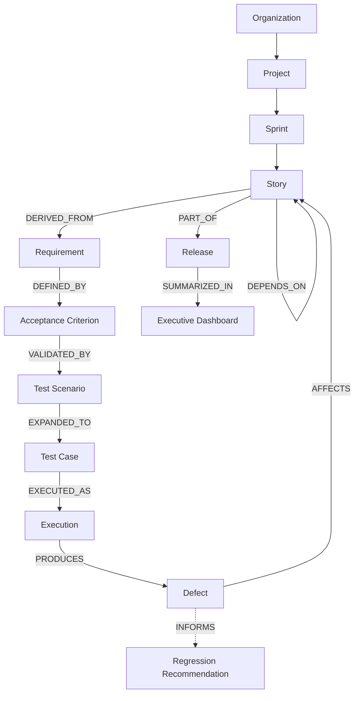

**Graph traversal for impact analysis:** when a Requirement changes, the Relationship Engine
traverses `Requirement → AcceptanceCriterion → TestScenario → TestCase → Execution` to identify
every downstream artifact that may now be stale — surfaced to QA as an "impacted tests" list and
fed to the Regression Intelligence Agent as prioritization signal. The same traversal, run in
reverse from a `Defect`, powers root-cause hinting (`Defect → Execution → TestCase → AcceptanceCriterion
→ Requirement → Story`). This structural traversal, combined with semantic retrieval, is what lets
agents "reason" over context instead of operating on a single row at a time.

---

## 13. AI Governance

A dedicated module ensuring every AI artifact and decision is controlled, approved, and explainable
— a hard requirement for enterprise/regulated customers.

| Capability | Description |
|---|---|
| **Prompt Governance / Prompt Lifecycle** | `AiPrompt` moves through `Draft → In Review → Approved → Active → Deprecated`; only `Approved` prompts can be promoted to `Active` |
| **Prompt Approval Workflow** | A designated `PromptApprover` role (RBAC, §25) must approve a new prompt version before promotion; approval decisions are recorded in `PromptApproval` with reviewer, rationale, and diff against previous version |
| **Prompt Version Promotion / Rollback** | Promotion is atomic (single `isActive` flag flip per capability, previous version retained); rollback is a first-class action, not a redeploy — restores the previous `isActive` version instantly |
| **Model Governance / Model Registry** | `ModelRegistryEntry` catalogs every approved `(provider, model, version)` tuple with allowed capabilities, cost tier, and org-level allow-list — agents may only invoke registered models |
| **Model Routing** | Declarative routing rules (`capability → preferred model → fallback chain`) evaluated by the Agent Execution Engine (§10.3), governed (not ad-hoc) |
| **Prompt Audit / AI Decision Audit** | Every `AgentRun`/`AiResponse` records prompt id+version+hash, model, input summary, output, confidence, and (if applicable) human review outcome — a full replayable decision trail |
| **Human Approval** | Low-confidence or high-impact outputs (e.g. Release Guardian Agent's readiness score below threshold) route to a Human Approval queue before being published to end users |
| **AI Explainability** | Every AI-generated artifact surfaces "why" metadata in the UI: source prompt version, retrieved memory/knowledge fragments used, confidence score, and — for governed capabilities — the approving reviewer |
| **Safety Policies / Guardrails** | Output Validation (JSON Schema, §9.2/16.3 in v1.0) + content policy checks (PII leakage, prohibited content) run as a mandatory post-processing node before persistence; guardrail violations block publication and raise an `ai.guardrail.violated` event |
| **Compliance Logging** | Guardrail decisions, approvals, and rollbacks are written to the same `AuditLog` used platform-wide (§25), tagged `domain: ai-governance` for compliance reporting |

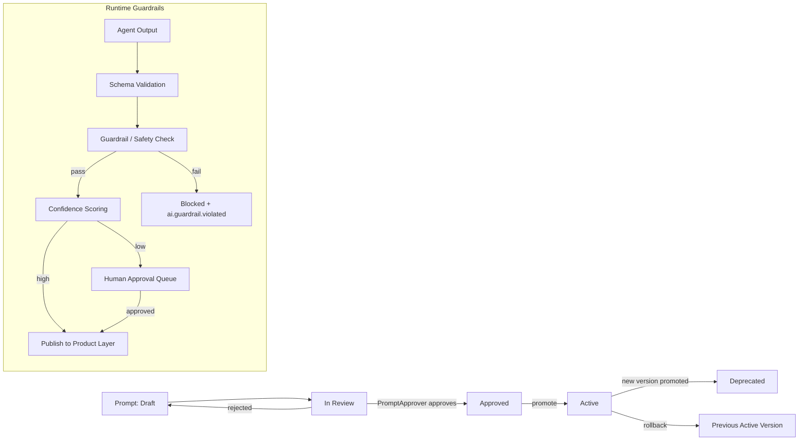

---

## 14. AI Operations (AIOps)

A dedicated bounded context providing operational visibility into every agent, prompt, and provider
— the telemetry backbone that feeds the Executive Analytics "AI Ops" panel.

| Capability | Description |
|---|---|
| **Token Monitoring** | Per-request and aggregated (org/day/capability) token counts captured from provider responses |
| **Cost Monitoring** | Token counts × provider price sheet → real-time cost attribution per org/project/capability |
| **Latency** | P50/P95/P99 latency per agent/provider/model, tracked via OpenTelemetry spans |
| **Provider Health / Model Health** | Rolling error-rate and availability per provider/model; feeds the circuit breaker (§10.3) and cost-aware router (§15) |
| **Prompt Performance / Agent Performance** | Acceptance rate, average confidence, repair-loop frequency per prompt version and per agent |
| **Hallucination Tracking** | Heuristic + human-feedback signals (flagged outputs, rejected suggestions) aggregated per prompt/model to detect drift |
| **Acceptance Rate / Confidence Distribution** | QA accept/reject actions on AI-generated scenarios/cases feed a distribution used both for reporting and as a Historical AI Memory input to confidence scoring |
| **AI Dashboard** | Executive-facing view: cost trend, token burn vs. budget (§15), top failing prompts, agent success rates |
| **Failure Analysis / Retry Statistics** | Aggregated view of retry counts, repair-loop outcomes, and terminal failures (routed to Human Approval) per agent |
| **Usage Analytics** | Org/team-level usage broken down by capability, useful for both product analytics and billing (§20) |
| **Model Benchmarking / Provider Benchmarking** | Scheduled evaluation harness (§16.4) results tracked over time per model/provider so routing decisions are evidence-based, not static |

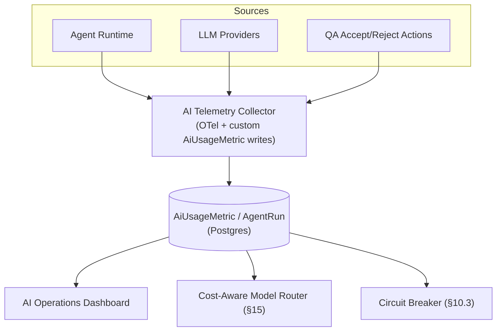

---

## 15. AI Cost Optimization

| Mechanism | Description |
|---|---|
| **Prompt Cache** | Deterministic-prefix prompt caching (provider-native where available, e.g. Anthropic prompt caching) for repeated system/context prefixes across agent runs within a project |
| **Semantic Cache** | Redis-backed cache keyed by embedding similarity of the input — near-duplicate requests (e.g. re-analyzing a lightly-edited story) return a cached result above a similarity threshold, subject to a freshness TTL |
| **Embedding Cache** | Embeddings are content-hash keyed; identical content (across stories/docs) never re-embeds |
| **Token Budget** — Monthly / Per-Organization Budget | `UsageQuota` (SaaS Platform, §20) enforces a monthly token/cost budget per org; the Agent Execution Engine checks remaining budget before dispatch and degrades gracefully (cheap-tier model or queued-for-later) when near the cap |
| **Model Selection Strategy / Cost-Aware Routing** | Model Routing rules (§13) can be cost-aware: route "cheap" capabilities (e.g. Coverage Guardian's narrative) to a low-cost model tier, reserve reasoning-tier models for high-value capabilities (Release Guardian, Risk Prediction) |
| **Fallback Model Strategy / Automatic Provider Switching** | On provider error-rate breach or budget pressure, the router automatically switches to the configured fallback provider/model without agent-level code changes (§10.3, §14 Provider Health) |
| **Prompt Compression** | Long context (e.g. large story backlogs) is summarized via Project Memory (§11.2) before inclusion rather than sent raw, bounding input token cost |
| **Response Compression** | Structured JSON outputs avoid verbose prose; Executive Insight Agent narrative length is a configurable governance parameter |

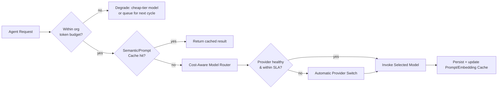

---

## 16. AI Layer Architecture (Provider, Prompting, RAG, Evaluation)

### 16.1 Provider Abstraction (Strategy Pattern)

```
IAiProvider (port, application layer of `ai` module)
 ├── ClaudeProvider        (infrastructure — @anthropic-ai/sdk)
 ├── OpenAiProvider        (infrastructure — openai SDK)
 └── GeminiProvider        (infrastructure — @google/generative-ai SDK)

IEmbeddingProvider (port, mirrors IAiProvider, used by Knowledge Intelligence §12)

AiOrchestrationService (application)
 - invoked by the Agent Execution Engine (§10.1), not directly by agents
 - resolves provider per AiCapability + Model Registry entry + org config (§13/§15)
 - wraps every call with: prompt versioning, JSON Schema validation of output, confidence scoring,
   retry/circuit breaker, cost + latency metering, persistence of AiJob/AiResponse
```

`IAiProvider.complete(request: AiCompletionRequest): Promise<AiCompletionResult>` is the only method
consumers depend on — model name, SDK-specific auth, and request/response shape translation are
fully encapsulated per adapter. Adding a 4th provider (e.g. local Llama via Ollama) requires zero
changes outside `infrastructure/ai-providers/`, and requires only a new `ModelRegistryEntry` (§13)
to become usable by agents.

### 16.2 LangGraph Workflow Model (per-agent graph)

Each specialized agent (§10.2) is modeled as a LangGraph `StateGraph` with explicit nodes:

```
[Ingest Context] → [Retrieve Memory/Knowledge (§11/§12)] → [Build Prompt (versioned template, §13)]
   → [Check Budget/Cache (§15)] → [Invoke IAiProvider] → [Validate JSON Schema]
   → [Guardrail Check (§13)] → [Score Confidence] → [Persist AiResponse]
   → [Emit Domain/Integration Event (§9)]
```

Low-confidence or schema-invalid outputs route to a `[Repair Attempt]` node (re-prompt with the
validation error) with a bounded retry count before falling back to a `[Flag for Human Review]`
terminal node (§13 Human Approval) — never silently returning malformed data to the product layer.
Multi-agent pipelines compose these per-agent graphs into a larger orchestrated graph managed by the
Agent Orchestrator (§10.1).

### 16.3 Prompt Versioning

- `AiPrompt` table stores `{ capability, version, template, jsonSchema, model, createdBy, status,
  isActive }`, with `status` driven by the AI Governance lifecycle (§13).
- Prompts are rendered with a typed variable map (no raw string concatenation) and hashed; the hash
  + version is stored on every `AiJob`/`AgentRun` so any historical AI output is fully
  reproducible/auditable.
- Prompt Management UI (frontend scope) allows creating a new version, A/B-testing against the
  active version (via Feature Management experiments, §17), and submitting for approval — never
  mutating a version in place.

### 16.4 RAG-Ready Architecture

- Superseded operationally by the Knowledge Intelligence Layer (§12), which is the concrete
  implementation of "RAG-ready" from v1.0: PostgreSQL `pgvector` stores embeddings for stories,
  requirement docs, and prior AI responses; retrieval blends graph traversal + vector similarity.
- Retrieval is the `[Retrieve Memory/Knowledge]` LangGraph node (§16.2) so it can be enabled per
  capability without touching the provider or persistence layers.

### 16.5 Evaluation & Confidence Scoring

- Every `AiResponse`/`AgentRun` stores a `confidenceScore` (0–1) derived from: schema validation
  pass/fail, self-consistency checks, and historical acceptance rate of similar outputs (§14
  Acceptance Rate feeds this loop).
- An `ai-evaluation` harness (offline, run in CI) replays a golden dataset of stories against each
  prompt version/provider/model combination and reports precision/recall-style metrics — results
  are persisted as `Benchmark` records (§14 Model/Provider Benchmarking) and gate promotion in AI
  Governance (§13).

---

## 17. Feature Management

A Platform module providing controlled, incremental exposure of capability — required both for safe
AI Governance rollouts (new prompt/agent versions) and general product feature delivery.

| Capability | Description |
|---|---|
| **Feature Flags** | Boolean/multivariate flags evaluated per request, cached in Redis, source-of-truth in Postgres (`FeatureFlag`) |
| **Organization Features** | Flags can be scoped globally, per-org, or per-user; resolution order is user → org → global default |
| **Beta Features** | A dedicated `beta` flag category surfaced in Organization Settings for opt-in early access |
| **Rollout Percentage** | Deterministic hash-based bucketing (`hash(orgId + flagKey) % 100 < rollout`) for gradual rollout without flapping between requests |
| **A/B Testing / Experiments** | `Experiment` aggregate ties a flag to variants + success metrics (e.g. prompt version A vs. B acceptance rate, sourced from §14) |
| **Canary Releases** | Deployment-level flag combined with rollout percentage to canary new agent/prompt versions to a small org subset before full promotion |
| **Feature Dependencies** | Flags can declare prerequisite flags (e.g. "Workflow Designer UI" depends on "Workflow Engine backend") — evaluated at resolution time to prevent inconsistent states |
| **Remote Configuration** | Non-boolean config values (e.g. default model per capability, budget thresholds) delivered through the same flag/config resolution path so operational tuning doesn't require redeploys |

---

## 18. Integration Hub

Replaces the original Integration Module with a richer, connector-based architecture supporting
many more systems without bespoke per-integration plumbing.

| Component | Responsibility |
|---|---|
| **Connector SDK** | A typed base (`BaseConnector implements IIntegrationProvider`) that concrete connectors extend, standardizing auth, pagination, rate-limit handling, and event mapping |
| **Connector Registry** | Catalog of installed connectors (built-in + plugin-provided, §22) and their capabilities (pull sprints, push comments, sync test results, etc.) |
| **Webhook Engine** | Verifies signatures, deduplicates, and routes inbound webhook payloads to the correct connector's normalization logic |
| **Polling Engine** | For systems without reliable webhooks, a scheduled poller (BullMQ repeatable jobs) checks for changes since last sync cursor |
| **Integration Scheduler** | Coordinates polling cadence per connector/org, respecting each system's rate limits |
| **Authentication Manager / Credential Vault** | Manages OAuth2 authorization-code flows and API-key auth per connector; tokens encrypted at rest (AES-256-GCM, envelope encryption via KMS) and scoped per organization |
| **Rate Limit Handler** | Token-bucket limiter per external system credential, backed by Redis, shared across polling and webhook-triggered calls |
| **Retry Engine** | Shared exponential-backoff retry wrapper (same primitive used by the Agent Execution Engine, §10.3) for outbound connector calls |
| **Transformation Layer** | Maps each external system's native schema to SprintGuard's canonical domain model (`Story`, `Sprint`, etc.) via per-connector mapper classes — keeps Domain entities free of vendor-specific shapes |

**Supported connectors (MVP: Jira fully implemented; remainder defined via Connector SDK interface,
stubbed):** Jira (reference implementation), Azure DevOps, GitHub, GitLab, Linear, Slack, Microsoft
Teams, Confluence, Notion, TestRail, Xray, Zephyr, Azure Test Plans.

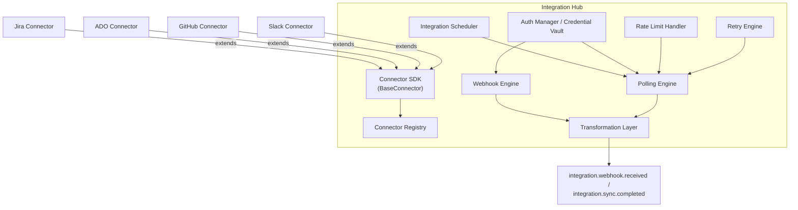

---

## 19. API Architecture

| API Style | Purpose |
|---|---|
| **REST** | Primary public/internal API surface, OpenAPI/Swagger documented (§9 backend deliverable) |
| **GraphQL (Ready)** | A `graphql/` gateway module fronting the same Application-layer use cases, for flexible dashboard/analytics querying without REST over/under-fetching |
| **WebSockets** | Realtime Gateway (§9.4) — job progress, live dashboards |
| **Server-Sent Events** | Streaming AI generation output (token/stage-level) to the AI Test Generator UI |
| **Webhook APIs** | Inbound (Integration Hub receiving external events) and outbound (SprintGuard notifying customer-configured endpoints of release-readiness changes, etc.) |
| **Internal APIs** | Service-to-service calls between `apps/api`, Agent Runtime, and Job Workers — authenticated via short-lived service JWTs, not exposed externally |
| **Public APIs** | Versioned (`/api/v1/...`), API-key authenticated (§20), rate-limited per plan tier |
| **Admin APIs** | Platform-admin-only surface (`/api/v1/admin/...`) for org management, feature flags, prompt governance approvals — protected by a distinct `PlatformAdmin` role, never exposed to tenant users |
| **Versioning Strategy** | URI versioning (`/v1`, `/v2`) for breaking changes; additive fields never require a version bump; deprecated versions sunset on a published timeline surfaced in API docs |
| **API Gateway** | Ingress-level (§27) JWT verification, rate limiting, and routing to `web`/`api`/`realtime`/`gateway` containers |
| **Rate Limiting** | Per-org and per-API-key token-bucket limits (`@nestjs/throttler` + Redis), tiered by subscription plan (§20) |
| **API Analytics** | Per-endpoint/per-key usage captured for both platform observability (§26) and customer-facing usage reports (§20) |

---

## 20. Document Intelligence

A dedicated module that turns unstructured artifacts (requirement docs, exported sprint files,
attachments) into structured, linkable knowledge feeding §12.

| Capability | Description |
|---|---|
| **PDF / Word / Excel / CSV Parsing** | Format-specific extractors (`pdf-parse`/`mammoth`/`exceljs`/`csv-parse`) behind a single `IDocumentParser` port, selected by MIME type |
| **OCR / Image Understanding** | For scanned/image-embedded content, an OCR pipeline (Tesseract or vendor OCR API) extracts text; image understanding (vision-capable LLM call) extracts descriptive context for embedded diagrams/screenshots |
| **Document Classification** | Lightweight model/heuristic classifies a document's type (requirement spec, meeting notes, design doc) to select the appropriate downstream extraction template |
| **Document Chunking** | Splits parsed content into semantically coherent chunks (heading-aware, token-bounded) before embedding |
| **Embedding Pipeline** | Each chunk embedded via `IEmbeddingProvider` (§16.1) and stored in pgvector, linked as a `KnowledgeNode` (§12) |
| **Metadata Extraction** | Author, source system, document date, and detected entities (story/requirement references) extracted and attached to each chunk |
| **Language Detection** | Detected per document to select locale-appropriate downstream prompts where relevant |
| **PII Detection** | Pattern + model-assisted PII scan on ingested documents; flagged content is masked before being used as agent context and logged for compliance (§25) |

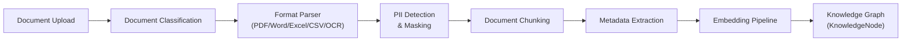

---

## 21. SaaS Platform Features

| Capability | Description |
|---|---|
| **Subscription Management / Billing** | `Subscription` aggregate synced with a Stripe-compatible billing provider; plan tiers gate feature flags (§17) and rate limits (§19) |
| **Organization Onboarding / Workspace Provisioning** | Guided onboarding flow provisions default project/roles/prompt versions for a new org in a single transactional setup routine |
| **API Keys** | Org-scoped API keys (hashed at rest, prefix-visible for identification) for programmatic/public API access, independently revocable |
| **Usage Quotas** | Enforces plan-tier limits (seats, AI token budget §15, integration connection count) |
| **White-Label Support / Tenant Branding** | Per-org logo/color theme applied to the web app shell and customer-portal/report exports |
| **Usage Reports** | Org-facing breakdown of AI usage, seat utilization, and integration sync volume (sourced from §14 Usage Analytics) |
| **Audit Center** | Org-admin-facing UI over `AuditLog` (§25) with filtering/export for compliance reviews |
| **Customer Portal** | Self-service plan management, invoices, API key management, usage reports |

---

## 22. Plugin Architecture

An Extension SDK allowing new capability to be registered without modifying core modules —
first-party agents/connectors are themselves built as "built-in plugins" to validate the same SDK
external developers would use in a future marketplace.

| Plugin Type | Extension Point |
|---|---|
| **AI Plugins** | Register a new `IAiProvider` implementation (e.g. a local model) via the Plugin Registry |
| **Integration Plugins** | Register a new Connector (§18) implementing `BaseConnector` |
| **Prompt Plugins** | Register new prompt templates for existing agents (subject to AI Governance approval, §13) |
| **Agent Plugins** | Register a new `IAgent` implementation + its `IAgentTool` set into the Agent Registry (§10.1) |
| **Workflow Plugins** | Register new node types consumable by the Workflow Engine (§23) |

| Component | Responsibility |
|---|---|
| **Extension SDK** | Versioned TypeScript interfaces (`IAiProvider`, `IIntegrationProvider`, `IAgent`, `IAgentTool`, `IWorkflowNode`) published as an internal package (`packages/plugin-sdk`) |
| **Plugin Registry** | Tracks installed plugins, versions, and per-org enablement (integrates with Feature Management, §17) |
| **Plugin Marketplace** *(Future)* | A curated catalog for third-party plugin distribution; MVP ships only first-party plugins registered at boot |

---

## 23. Workflow Designer (Workflow Engine)

A Workflow Engine bounded context lets QA/Admin users compose and customize AI/test pipelines
visually, on top of the same Agent Capability Registry (§10.1) that powers built-in pipelines.

| Capability | Description |
|---|---|
| **Visual AI Workflow / Visual Test Pipeline** | Frontend drag-and-drop canvas (React Flow-style) composing a `WorkflowDefinition` graph from available agent/tool "nodes" (declared via Agent Capability Registry + Plugin Workflow nodes) |
| **Drag and Drop** | Frontend-only concern (§ frontend scope) backed by a serializable `WorkflowDefinition` JSON schema |
| **Workflow Templates** | Pre-built definitions (the default Sprint→Release pipeline from §9.3) users can clone/customize rather than build from scratch |
| **Workflow Versioning** | Same versioning discipline as prompts (§16.3) — `WorkflowDefinition` versions are immutable once activated, edits create a new version |
| **Workflow Approval** | High-impact custom workflows (e.g. one that publishes directly to Release Governance) require approval, reusing the AI Governance approval primitive (§13) |
| **Workflow Simulation** | Dry-run mode executes the graph against historical data without calling live LLM providers (using cached/replayed `AiResponse`s) to validate a workflow before activation |

At runtime, a `WorkflowRun` is executed by the Agent Orchestrator (§10.1) exactly like a built-in
pipeline — the Workflow Engine only affects how the graph is *composed*, not how it's *executed*,
keeping the Agent Runtime as the single execution engine.

---

## 24. Knowledge Graph — Cross-Cutting View

(Entity relationship detail and Mermaid diagram covered in §12.2.) The Knowledge Graph is the
substrate that both the Agent Framework (§10, via Knowledge Memory) and the frontend (impacted-tests
views, traceability matrices) query through the same `IKnowledgeGraphRepository` port. Two access
patterns are supported:

- **Structural traversal** (recursive CTE over `KnowledgeEdge`) — "what tests cover this
  requirement," "what stories does this release include" — deterministic, used for coverage/impact
  analysis (§6 Coverage & Risk context).
- **Semantic traversal** (pgvector similarity over `KnowledgeNode` embeddings) — "what past stories
  are similar to this one" — probabilistic, used for agent context retrieval (§11 Memory Retrieval
  Layer) and duplicate-story detection.

Combining both is what allows, e.g., the Risk Prediction Agent to answer "is this story risky"
using both explicit dependency edges *and* semantic similarity to historically risky stories.

---

## 25. Security Architecture

- **AuthN:** JWT (short-lived access token + rotating refresh token, httpOnly cookie for web),
  OAuth2 authorization-code flow for integration connections (Jira etc., via Integration Hub's Auth
  Manager §18), password hashing via Argon2id, API keys for programmatic access (§20).
- **AuthZ:** RBAC — `Role` (OrgOwner, OrgAdmin, ProjectAdmin, QALead, QAEngineer, ProductManager,
  Engineer, Viewer, **PromptApprover**, **PlatformAdmin**) × `Permission` matrix, enforced via a
  `PermissionsGuard` + `@RequirePermission()` decorator at the controller method level, re-checked at
  the Application layer for defense-in-depth on non-HTTP entry points (BullMQ jobs, GraphQL, agent
  tool invocations).
- **Tenant isolation:** see §8.
- **Transport/Secrets:** TLS everywhere, secrets via environment/secret manager (never in code),
  integration OAuth tokens encrypted at rest via the Credential Vault (§18, AES-256-GCM, envelope
  encryption with a KMS-managed key).
- **AI Safety:** Guardrails and output validation (§13) prevent unsafe/PII-leaking AI output from
  reaching end users; Document Intelligence PII Detection (§20) prevents sensitive data from
  entering agent context in the first place.
- **Abuse control:** per-tenant + per-IP rate limiting (Redis token bucket via `@nestjs/throttler`
  + custom tenant-aware guard), circuit breakers around outbound LLM/integration calls (§10.3,
  §18), exponential-backoff retry policies.
- **Compliance:** full audit log (`AuditLog` table — actor, action, target, before/after diff,
  timestamp, IP) for every mutating action including AI governance decisions (§13); GDPR
  data-subject export/delete workflows scoped by org + user; soft-delete + retention policy on
  PII-bearing tables; Audit Center (§21) for self-service compliance review.

---

## 26. Observability

- **Tracing/Metrics/Logs:** OpenTelemetry SDK instrumented across `apps/api`, the Agent Runtime, and
  Job Workers, exported via OTLP to a collector, backed by Prometheus (metrics) + Grafana
  (dashboards) or a vendor APM. Winston structured JSON logging, correlation-id propagated from
  `Web → API → Agent Orchestrator → Agent → LLM call`, so a single sprint-import can be traced
  end-to-end across the async, multi-agent pipeline in §9.3.
- **Health checks:** `@nestjs/terminus` — liveness (`/health/live`), readiness (`/health/ready`
  checks DB, Redis, LLM provider reachability, and Integration Hub connector health), used by
  container orchestrator probes.
- **AI-specific observability:** fully covered by the AI Operations bounded context (§14) — every
  `AgentRun` records provider, model, token usage, latency, cost, and confidence score, rolled up
  into the AI Ops dashboard within Executive Analytics.

---

## 27. Deployment Architecture

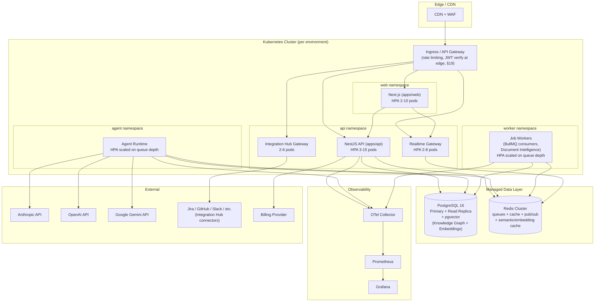

**Environments:** `local` (Docker Compose), `dev`, `staging`, `production` — identical container
images promoted across environments, config injected via environment variables/secret manager, no
environment-specific code branches.

**CI/CD (structure, wired in Step 11):** GitHub Actions → lint/typecheck/unit/integration tests →
AI evaluation harness (§16.5) run against golden dataset → build + push Docker images (tagged by
commit SHA) → deploy to `dev` automatically, `staging`/`prod` via manual approval gate → Prisma
migrations run as a pre-deploy job (`prisma migrate deploy`) with automatic rollback on failure.

---

## 28. Technology Stack Rationale

| Layer | Choice | Why |
|---|---|---|
| Frontend framework | Next.js 15 (App Router) | SSR/streaming for dashboards, file-based routing, React Server Components reduce client bundle for data-heavy analytics pages; supports the Workflow Designer canvas and realtime-updated dashboards |
| Frontend state | Zustand + TanStack Query | Zustand for local/UI state (incl. Workflow Designer canvas state), TanStack Query for server-state caching/invalidation — avoids Redux boilerplate while staying predictable at enterprise scale |
| Forms/validation | React Hook Form + Zod | Shared Zod schemas between frontend validation and backend DTO validation (`packages/shared`), also used to validate agent structured outputs (§16) |
| UI | Tailwind + ShadCN UI + Framer Motion + Recharts | Accessible, themeable (dark mode) primitives; Recharts for analytics/AI Ops dashboards without heavy charting lock-in |
| Realtime | WebSocket (`@nestjs/websockets` + Redis adapter) + SSE | Multi-pod-safe fan-out for live dashboards/AI job streaming (§9.4) |
| Backend framework | NestJS | First-class DI, modular architecture, CQRS/GraphQL/microservices/WebSocket support out of the box — matches Clean Architecture/DDD/Agent Framework goals directly |
| ORM | Prisma | Type-safe schema-as-code, migration tooling, works well with the Repository pattern (repositories wrap Prisma, never leak `PrismaClient` to Domain) |
| DB | PostgreSQL 16 + pgvector | Relational integrity for tenant/audit/graph data + native vector search for Knowledge Intelligence without a separate vector DB in MVP |
| Queue/Cache | Redis 7 + BullMQ | Durable job queues, rate-limit counters, pub/sub (realtime fan-out), semantic/embedding cache, feature flag cache — one operational dependency covering many needs |
| AI orchestration | LangGraph + LangChain | Explicit, inspectable state machines for agent/multi-agent workflows vs. implicit agent loops; LangChain for provider-agnostic primitives (prompt templates, output parsers) |
| Document parsing | `pdf-parse`, `mammoth`, `exceljs`, `csv-parse`, OCR engine | Format-specific best-of-breed libraries behind a single `IDocumentParser` port (§20) |
| Billing | Stripe-compatible SDK | Industry-standard subscription/usage billing integration behind an `IBillingProvider` port (§21) |
| Observability | OpenTelemetry + Winston | Vendor-neutral instrumentation; Winston for structured logs correlated with OTel trace IDs; custom `AiUsageMetric` writes for AIOps (§14) |
| Containerization | Docker + Kubernetes-ready | Local parity via Compose, production scalability via K8s HPA (incl. queue-depth-based agent/worker scaling) without re-architecture |

---

## 29. Non-Functional Requirements Mapping

| NFR | Architectural Mechanism |
|---|---|
| Scalable | Stateless API/agent/worker pods behind HPA; queue-depth-based agent/worker autoscaling; read replica for analytics-heavy queries |
| Secure | JWT+RBAC+RLS+audit log+encrypted Credential Vault (§25, §18) |
| Cloud-native | 12-factor config, container images, health probes, no local disk state |
| Multi-tenant / Tenant Isolation | Row-level isolation + Postgres RLS (§8) + per-tenant feature/budget/credential scoping (§17, §15, §18) |
| High availability | Multi-pod deployments, managed Postgres with replica/failover, Redis cluster mode |
| Audit-ready | `AuditLog` on every mutation, AI decision audit trail (§13), prompt/version reproducibility (§16.3) |
| GDPR-ready | Per-tenant/user export & delete workflows, soft-delete + retention policy, encryption at rest, PII Detection on ingested documents (§20) |
| Observability | OTel traces/metrics/logs end-to-end, AI Operations panel (§14, §26) |
| Performance | TanStack Query caching, Redis/semantic/embedding cache (§15), read replica, pagination-by-default on list endpoints |
| Resilience | Circuit breakers + retry policies on outbound LLM/integration calls (§10.3, §18), idempotent event consumers, transactional outbox |
| AI Accuracy / AI Reliability / Prompt Reliability / Agent Reliability | Evaluation harness + benchmarking (§16.5, §14), confidence scoring + repair loops (§10.3, §16.2), Human Approval fallback (§13) |
| Model Availability / Model Portability | Provider abstraction (§16.1) + automatic provider switching (§15) — no hard dependency on a single vendor |
| Cost Efficiency | AI Cost Optimization mechanisms (§15) — caching, budgets, cost-aware routing |
| Governance / AI Explainability / AI Safety | AI Governance module (§13) — approval workflow, model registry, guardrails, decision audit |
| Platform Extensibility | Plugin Framework (§22) + Workflow Engine (§23) + Connector SDK (§18) |

---

## 30. Next Artifacts in Sequence

1. ✅ Solution Architecture (this document)
2. ⏭ Database Design — [02-database-design.md](02-database-design.md) + `packages/database/prisma/schema.prisma`
3. ⏭ Backend Folder Structure
4. ⏭ Frontend Folder Structure
5. ⏭ Authentication Module
6. ⏭ Dashboard
7. ⏭ Sprint Intelligence Module
8. ⏭ AI Services (Agent Framework implementation)
9. ⏭ APIs
10. ⏭ UI Components
11. ⏭ Deployment
12. ⏭ Testing Strategy
13. ⏭ Production Checklist
