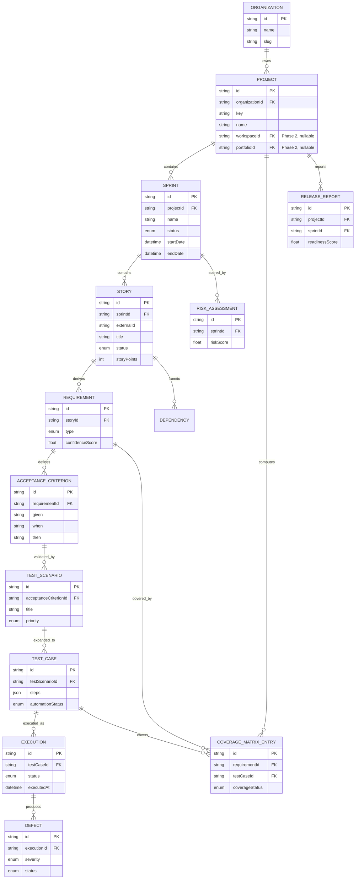
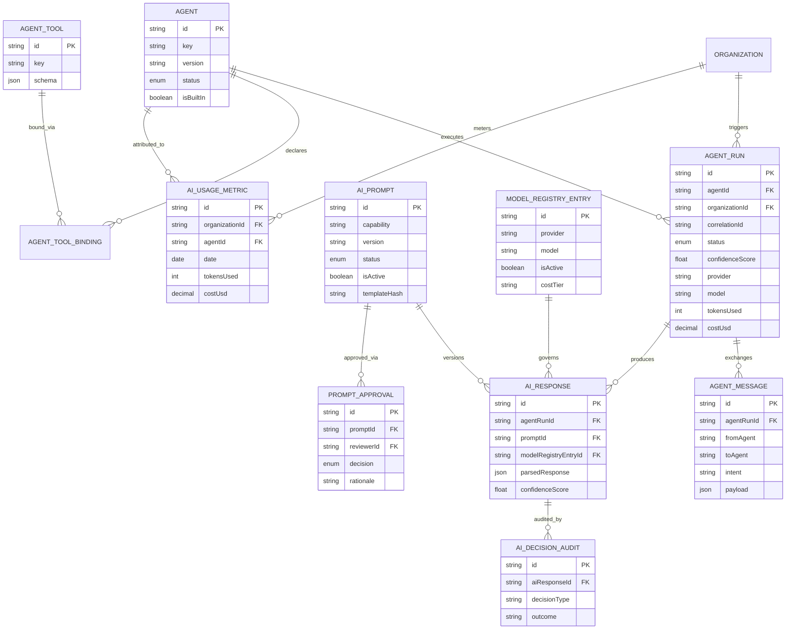
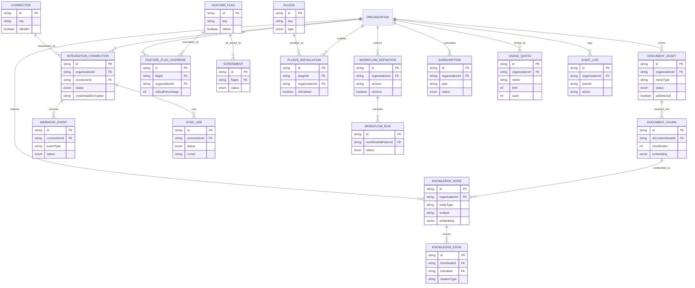

# SprintGuard AI — Database Design

Status: Draft v3.0 · Owner: Platform Architecture · Last updated: 2026-07-21

Companion to [01-solution-architecture.md](01-solution-architecture.md). Implements the persistence
model for every bounded context defined there (§6), including the enterprise capabilities added in
v2.0 (Agent Framework, AI Governance, AI Operations, Knowledge Intelligence, Document Intelligence,
Integration Hub, Feature Management, Plugin Framework, Workflow Engine, SaaS Platform), and the
enterprise data-architecture depth added in v3.0 (aggregate boundaries, organization hierarchy,
traceability, evaluation, cost management, read models, time-series strategy, and decision
records). The executable schema is at
[`packages/database/prisma/schema.prisma`](../../packages/database/prisma/schema.prisma) and
implements the **MVP-labeled** entities below; **Phase 2/3/Future**-labeled entities are documented
now to reserve the correct shape but are intentionally not yet in the Prisma schema, per the
project's "don't add unnecessary complexity to MVP" principle.

---

## 1. Design Rules (apply to every table)

| Rule | Detail |
|---|---|
| Multi-tenancy | Every tenant-scoped table carries `organizationId` (indexed, FK to `Organization`); enforced by `TenantScopedRepository` + Postgres RLS (Solution Architecture §8) |
| Primary keys | `String @id @default(cuid())` — sortable-enough, collision-safe, no round-trip to DB needed before referencing a new row in the same transaction |
| Audit columns | `createdAt`, `updatedAt` on every table; mutation-heavy aggregates additionally carry `createdBy`/`updatedBy` |
| Soft delete | PII-bearing / user-facing aggregates carry `deletedAt DateTime?` rather than hard delete, to satisfy GDPR export/delete workflows (Solution Architecture §25) while preserving referential integrity for audit |
| JSONB for AI/flexible payloads | Agent/AI I/O, workflow graphs, and provider raw responses are stored as `Json` (Postgres `jsonb`) rather than modeled relationally — these are schema-versioned by the *application* (prompt/workflow versioning), not the database |
| Vector columns | `Unsupported("vector(1536)")` (pgvector) on every embedding column, HNSW-indexed via raw SQL migration (Prisma does not yet manage vector indexes natively) |
| Enums over free strings | Status/type fields use Prisma `enum` wherever the value set is closed and stable |
| Outbox pattern | `OutboxMessage` table (§ Event-Driven reliability) backs the transactional outbox described in Solution Architecture §9.2 |

---

## 2. Aggregate Root Documentation

DDD aggregates define the true transaction/consistency boundaries beneath the Prisma tables — this
is the mapping every Application-layer command handler (Solution Architecture §7) must respect:
**a command loads and saves exactly one aggregate root per transaction**; cross-aggregate effects
happen via domain/integration events (§9 of the Solution Architecture), never a multi-aggregate
transaction.

| Aggregate | Root Entity | Child Entities (same transaction) | Ownership Rule | Transaction Boundary | Consistency Boundary | Lifecycle |
|---|---|---|---|---|---|---|
| **Organization** | `Organization` | `Membership`, `TenantBranding` | Root owns tenant identity metadata; `Membership` rows are deleted with the org (cascade) | Single-row org metadata updates | Org-unique `slug`; billing/branding always consistent with the org row | Created at signup → active → (future) suspended → deleted (soft) |
| **Workspace** *(Phase 2)* | `Workspace` | — | Optional grouping above Portfolio/Project; owned by `Organization` | Workspace metadata update | Workspace name unique per org | Created by org admin → active → archived |
| **Portfolio** *(Phase 2)* | `Portfolio` | — | Groups related Projects for cross-project reporting; owned by `Workspace` (or directly by `Organization` if Workspace is skipped) | Portfolio metadata update | Portfolio name unique per workspace | Created → active → archived |
| **Project** | `Project` | — (Sprints are their own aggregate; Project only references) | Root owns project identity/config; `Project.key` unique per org | Project metadata update (rename, archive) | `(organizationId, key)` uniqueness | Created → active → archived (soft delete) |
| **Sprint** | `Sprint` | `Story`, `Requirement`, `AcceptanceCriterion`, `Dependency` (via Story) | Sprint owns the full story/requirement/AC graph for its lifetime; a Story never outlives its Sprint's cascade delete | Sprint import transaction persists Sprint + all Stories atomically | All Stories in a transaction reference a Sprint that exists in the same organization | Planned → Active → Completed/Cancelled |
| **Story** | `Story` | `Requirement`, `AcceptanceCriterion`, `Dependency` | Story owns its derived Requirements/ACs; agents write within one Story's boundary per run | One agent run's persistence of extracted Requirements/ACs for a single Story | Requirement/AC always reference a Story in the same Sprint/Project | Created (import) → analyzed → (immutable once Sprint closes, retained for history) |
| **Requirement** | `Requirement` | `AcceptanceCriterion` | Requirement owns its ACs; ACs cannot exist without a parent Requirement | AC batch write per Requirement | AC set is fully replaced (not merged) on re-analysis, versioned via `AgentRun` history, not in-place mutation | Extracted → (re-extraction produces a new set, old set retained for audit) |
| **Test Intelligence** | `TestScenario` | `TestCase` (and, Phase 2, `TestStep`, `TestData` — see §13) | Scenario owns its Cases; Cases never reference a Scenario outside the transaction that created them | Scenario + generated Cases persisted together per agent run | Every Case traces to exactly one Scenario, one AC | Generated → reviewed/edited by QA → (Phase 2) versioned |
| **Release** | `ReleaseReport` | — (future: `ReleaseCandidate`, `ReleaseGate`, §11) | Root computed from Coverage + Risk + Execution signal for one Project+Sprint | Single readiness computation per pipeline run | One `ReleaseReport` per `(projectId, sprintId)` generation cycle (new rows for re-runs, not overwritten) | Draft → Pending Approval → Published |
| **Agent** | `Agent` | `AgentRun` → `AgentMessage`, `AiResponse` (per run) | `Agent` catalog entry is the root; each `AgentRun` is its own execution-scoped aggregate keyed by `correlationId` | One `AgentRun` + its `AgentMessage`/`AiResponse` children commit together at run completion | `AgentRun.status` transitions are the source of truth; messages/responses cannot outlive their run's audit retention | Registered → Enabled → (per run) Pending → Running → Succeeded/Failed/Flagged |
| **Workflow** | `WorkflowDefinition` | `WorkflowRun` | Definition is immutable once `isActive`; each `WorkflowRun` is a separate execution-scoped aggregate | One `WorkflowRun` transaction per pipeline execution | `WorkflowRun` always references an immutable, already-persisted `WorkflowDefinition` version | Draft → Pending Approval → Active → Deprecated |
| **Knowledge** | `KnowledgeNode` | `KnowledgeEdge` (edges reference two nodes, not owned exclusively by either) | A node is owned by the entity it represents (e.g. a `Story`); edges are managed by the Relationship Engine, not by either endpoint node | Node upsert + its outbound edges per Relationship Engine invocation | Edge endpoints must exist and belong to the same organization | Created on entity create/update → superseded (not deleted) on re-embedding |
| **Document** | `DocumentAsset` | `DocumentChunk` | Asset owns its chunks; chunks never outlive the asset (cascade delete) | Full chunk set written per parse/embed pipeline run | Chunk `chunkIndex` sequence is contiguous per asset | Uploaded → Processing → Processed/Failed |
| **Integration** | `IntegrationConnection` | `WebhookEvent`, `SyncJob` | Connection owns its event/job history; a `Connector` (catalog) is a separate, shared reference aggregate | One `SyncJob` transaction per sync cycle | `WebhookEvent` dedupe key `(connectionId, externalId)` enforces idempotency | Pending → Connected → Error/Disconnected |
| **Subscription** | `Subscription` | — (future: `Invoice`, `Payment`, `UsageRecord`, §14) | One active `Subscription` per organization; billing-provider is the system of record, SprintGuard mirrors state | Subscription state sync per billing-provider webhook | Plan/seat/quota consistency enforced against `UsageQuota` | Trialing → Active → Past Due → Cancelled |

---

## 3. Organization Hierarchy

The MVP hierarchy is intentionally flat (`Organization → Project → Sprint`, as shipped in the
Prisma schema). This section documents the **future-ready** enterprise hierarchy so that adding
intermediate grouping levels later is additive (new nullable FKs), not a breaking migration.

```
Organization                         (MVP)
 └─ Workspace            (Phase 2, optional)
     └─ Portfolio         (Phase 2, optional)
         └─ Project                  (MVP)
             └─ Sprint                (MVP)
```

- **Workspace** *(Phase 2)*: an optional grouping above Portfolio, useful for large enterprises that
  run SprintGuard across multiple business units under one billing organization (e.g. "APAC",
  "EMEA"). `Project.workspaceId` will be added as a nullable FK — a `null` value means the project
  hangs directly off the Organization, preserving MVP behavior with zero migration risk for existing
  tenants.
- **Portfolio** *(Phase 2)*: groups related Projects for cross-project reporting (e.g. "Payments
  Platform" spanning three microservice projects). `Project.portfolioId` is similarly nullable.

**Impact of hierarchy on cross-cutting concerns:**

| Concern | Effect of Hierarchy |
|---|---|
| Permissions | RBAC `Membership` gains an optional `scopeType`/`scopeId` (Workspace/Portfolio/Project) so a role can be granted at any hierarchy level and inherited downward — a Workspace-level `QALead` sees every Project beneath it without per-project grants |
| Reporting | Executive Analytics (Solution Architecture MVP scope) aggregates roll up through whichever levels exist — Portfolio-level dashboards become possible without new tables, just a `GROUP BY portfolioId` once populated |
| Billing | `UsageQuota`/`Subscription` remain Organization-scoped (billing is a legal-entity concern), but Usage Reports can be sliced by Workspace/Portfolio for internal chargeback without changing the billing system of record |
| Feature Flags | `FeatureFlagOverride` resolution order extends to Organization → Workspace → Portfolio → Project → User, still resolving to a single winning value (§20) |
| Knowledge Sharing | Knowledge Graph nodes/edges (§17) stay Organization-scoped for tenant isolation, but a Portfolio-level "related projects" hint can bias semantic retrieval toward sibling projects once Portfolio exists |

Because every field involved is nullable and additive, **no MVP migration is required until a
customer actually needs Workspace/Portfolio** — this is a documented extension point, not a present
schema change.

---

## 4. ER Diagram — Core Sprint & Test Intelligence Domain



*(Extended from v2.0 only by the two nullable, Phase 2 `workspaceId`/`portfolioId` annotations on
`PROJECT`, per §3. No existing entity, relationship, or field was changed.)*

## 5. ER Diagram — Agent Framework & AI Governance Domain



*(Unchanged from v2.0. Future entities extending this domain — `AgentVersion`, `PromptVersion`,
`GoldenDataset`, etc. — are documented in §13, §14, §22 rather than added to this diagram, to keep
it representative of the current MVP schema.)*

## 6. ER Diagram — Knowledge, Document, Integration & Platform Domain



*(Unchanged from v2.0.)*

---

## 7. Identity Domain

The existing IAM tables (`User`, `Membership`, `Role`, `Permission`, `RolePermission`, `ApiKey`,
`RefreshToken` — all **MVP**, already in `schema.prisma`, unmodified) are documented here alongside
their future companions, so the Identity bounded context has one authoritative reference.

| Entity | Purpose | Phase | Key Relationships |
|---|---|---|---|
| `User` | Platform user identity | MVP | 1—N `Membership`; 1—N `RefreshToken` |
| `Membership` | User↔Organization↔Role join | MVP | belongs to `User`, `Organization`, `Role` |
| `Role` | Named RBAC role (system or custom) | MVP | N—N `Permission` via `RolePermission` |
| `Permission` | Fine-grained capability key (`sprint:read`, `prompt:approve`, ...) | MVP | N—N `Role` |
| `Invitation` | Pending org invite (email, proposed role, expiry, token) | Phase 2 | resolves into a `Membership` on acceptance |
| `Session` | Server-side session record for web login (device, IP, last-active) — complements stateless JWT with revocability | Phase 2 | belongs to `User` |
| `RefreshToken` | Rotating refresh token for JWT renewal | MVP | belongs to `User` |
| `OAuthAccount` | Linked third-party identity (Google/Microsoft SSO) for a `User` | Phase 2 | belongs to `User`; unique `(provider, providerAccountId)` |
| `ApiKey` | Org-scoped programmatic access credential | MVP | belongs to `Organization` |
| `UserPreference` | Per-user UI/notification preferences (theme, digest frequency) | Phase 2 | belongs to `User` |
| `OrganizationPreference` | Org-wide defaults (default timezone, default AI provider) | Phase 2 | belongs to `Organization` |
| `NotificationPreference` | Per-user, per-channel notification opt-in/out (mirrors `NotificationChannel` enum) | Phase 2 | belongs to `User` |

No existing IAM table's shape, name, or relationship changes — this section only documents the
target end-state so `Invitation`/`Session`/`OAuthAccount`/`*Preference` can be added later as
straightforward new tables with FKs into the existing `User`/`Organization`, never a rewrite.

---

## 8. Indexing Strategy

| Pattern | Index |
|---|---|
| Tenant scoping | Composite `(organizationId, id)` or leading `organizationId` on every tenant table — every query filters on it first |
| Foreign keys | Standard B-tree on every FK column (Prisma default) |
| Hot list/filter columns | `(organizationId, status)`, `(organizationId, createdAt DESC)` for paginated dashboards |
| Embeddings | HNSW (`vector_cosine_ops`) on `KnowledgeNode.embedding` and `DocumentChunk.embedding`, created via a raw-SQL Prisma migration (`CREATE INDEX ... USING hnsw`) |
| JSONB search | GIN index on `AgentRun.output`, `AiResponse.parsedResponse` where ad-hoc querying is needed for AI Ops debugging |
| Uniqueness | `(organizationId, key)` unique on `Project.key`, `FeatureFlag.key`, `Connector.key`, `Agent.key` — human-readable keys unique per tenant, not globally |

## 9. Row-Level Security

Every tenant-scoped table gets an RLS policy of the shape:

```sql
ALTER TABLE "Story" ENABLE ROW LEVEL SECURITY;
CREATE POLICY tenant_isolation ON "Story"
  USING ("organizationId" = current_setting('app.current_org_id')::text);
```

Applied via a Prisma migration `sql/rls_policies.sql` run after `prisma migrate deploy`; the
`app.current_org_id` session variable is set per request/job by a Prisma `$extends` client
middleware reading `TenantContext` (Solution Architecture §8).

## 10. Retention & Governance

| Data | Retention |
|---|---|
| `AuditLog`, `AiDecisionAudit`, `PromptApproval` | Indefinite (compliance) unless org requests GDPR erasure of a specific user's actor references |
| `AgentRun` / `AiResponse` | 18 months verbatim, then compacted into `AiUsageMetric` aggregates (Solution Architecture §11.2 Compression) |
| `ConversationMemory` (Redis) | 24h hot, archived to Postgres on session end, then subject to the same 18-month policy |
| `WebhookEvent` | 90 days (debugging window), then purged — sync outcomes already reflected in domain tables |
| Soft-deleted rows (`deletedAt`) | Purged by a scheduled job after the org's configured retention window (default 30 days) |

---

## 11. Release Domain Expansion

`ReleaseReport` (MVP, unchanged) remains the single readiness-scoring aggregate for the MVP. This
section documents the richer release/deployment model for later phases, once SprintGuard begins
tracking releases through actual deployment rather than only scoring readiness.

| Entity | Purpose | Phase | Key Relationships |
|---|---|---|---|
| `ReleaseReport` | Readiness score + executive summary for a Project+Sprint | **MVP (unchanged)** | belongs to `Project`, `Sprint` |
| `Release` | A named, versioned release train that may span multiple sprints | Phase 2 | 1—N `ReleaseCandidate` |
| `ReleaseCandidate` | A specific build/tag proposed for a `Release`, carrying its own readiness snapshot | Phase 2 | belongs to `Release`; references a `ReleaseReport` snapshot |
| `ReleaseApproval` | Human sign-off record on a `ReleaseCandidate` (mirrors `PromptApproval`'s approve/reject/rationale shape) | Phase 2 | belongs to `ReleaseCandidate`; references approving `User` |
| `ReleaseGate` | A named, configurable go/no-go rule (e.g. "readiness ≥ 85", "zero critical defects") evaluated against a `ReleaseCandidate` | Phase 2 | belongs to `Release`; evaluated per `ReleaseCandidate` |
| `Deployment` | A record of a `ReleaseCandidate` actually deployed to an `Environment` | Phase 3 | belongs to `ReleaseCandidate`, `Environment` |
| `Environment` | A named deployment target (dev/staging/prod) per Project | Phase 3 | belongs to `Project`; 1—N `Deployment` |
| `DeploymentHistory` | Immutable log of deployment state transitions (queued → deploying → succeeded/rolled back) | Phase 3 | belongs to `Deployment` |
| `DeploymentArtifact` | Reference to the built artifact (image tag, commit SHA) associated with a `Deployment` | Phase 3 | belongs to `Deployment` |

**Relationship summary:** `Release` groups `ReleaseCandidate`s, each of which is scored via a
`ReleaseReport` snapshot, gated by `ReleaseGate` rules, and signed off via `ReleaseApproval` before
becoming a `Deployment` into an `Environment` — turning today's single readiness score into a full
release-train governance model without altering the MVP `ReleaseReport` shape.

---

## 12. Test Intelligence Expansion

MVP ships `TestScenario → TestCase` with `TestCase.steps` as a single `Json` column (as shipped).
This section documents the fuller test hierarchy for later normalization.

| Entity | Purpose | Phase | Key Relationships |
|---|---|---|---|
| `TestSuite` | Named grouping of Scenarios for organized execution (e.g. "Regression Suite", "Smoke Suite") | Phase 2 | N—N `TestScenario` |
| `TestScenario` | AI-generated or authored scenario | **MVP (unchanged)** | belongs to `AcceptanceCriterion`, `Story` |
| `TestCase` | Executable case with steps/data | **MVP (unchanged, `steps` stays `Json`)** | belongs to `TestScenario` |
| `TestStep` | One normalized step (`order`, `action`, `expected`) exploded out of `TestCase.steps` | Phase 2 | belongs to `TestCase` |
| `TestData` | Named, reusable data sets (e.g. "valid-user-payload") referenced by one or more `TestStep`/`TestCase` | Phase 2 | N—N `TestCase` |
| `ExpectedResult` | Normalized expected-outcome record, separated from `TestStep` so multiple steps can share one assertion | Phase 3 | belongs to `TestStep` |
| `Execution` | A run of a `TestCase` | **MVP (unchanged)** | belongs to `TestCase`, `Sprint` |
| `ExecutionResult` | Per-step pass/fail detail within an `Execution` (today collapsed into `Execution.status`) | Phase 2 | belongs to `Execution`, `TestStep` |
| `ExecutionAttachment` | Screenshot/log/video evidence attached to an `Execution` (today a single `evidenceUrl` string) | Phase 2 | belongs to `Execution` |

**Why steps remain JSON in MVP:** `TestCase.steps` as `Json` lets the Test Case Agent (Solution
Architecture §10.2) emit a variable-length, schema-validated step list without a migration per
schema iteration — appropriate while the AI-generated shape is still evolving. Normalizing into
`TestStep`/`ExpectedResult`/`ExecutionResult` becomes valuable once (a) per-step execution reporting
and (b) cross-case `TestData` reuse are actual product requirements — at that point the JSON blob is
migrated into rows via a backfill script, and `TestCase.steps` is deprecated in favor of the
relational children, with the Agent output validated against the same JSON Schema either way.

---

## 13. Requirement Traceability

A dedicated traceability layer, complementary to but distinct from the Knowledge Graph (§17): the
Knowledge Graph is a general-purpose semantic/structural substrate, while Traceability is a
**point-in-time, audit-grade snapshot** of the specific chain regulated customers need to prove test
coverage against requirements.

| Entity | Purpose | Phase | Key Relationships |
|---|---|---|---|
| `TraceabilityLink` | A single directed link in the chain `Requirement → AcceptanceCriterion → TestScenario → TestCase → Execution → Defect → Release`, materialized from the same edges the Relationship Engine (§17) already derives | Phase 2 | references the two linked entities by `(entityType, entityId)`, mirroring `KnowledgeEdge`'s shape |
| `TraceabilitySnapshot` | An immutable, point-in-time capture of the full chain for a Requirement, taken at release time | Phase 2 | belongs to `ReleaseReport`; contains N `TraceabilityLink` references |
| `TraceabilityReport` | A generated, exportable document (PDF/CSV) summarizing coverage traceability for audit/compliance handoff | Phase 3 | derived from one or more `TraceabilitySnapshot`s |

**Impact analysis:** because `TraceabilityLink` mirrors the Knowledge Graph's edges, the same
traversal used for impact analysis in Solution Architecture §12.2 (`Requirement change →
AcceptanceCriterion → TestScenario → TestCase → Execution`, and in reverse from a `Defect`) is what
populates this table — Traceability is best understood as a **compliance-oriented, versioned
projection** of the live Knowledge Graph traversal, not a separate source of truth. When a
`TraceabilitySnapshot` is taken at release time, it freezes that traversal result so a later
Knowledge Graph update (e.g. a requirement edited post-release) never silently rewrites what a past
release was traced against.

---

## 14. Agent Framework Expansion

The existing `Agent`, `AgentRun`, `AgentMessage`, `AgentTool`, `AgentToolBinding` tables (**MVP**,
unchanged) remain the execution core. The following are documented as future companions —
purpose-only, no schema changes implied yet:

| Entity | Purpose | Phase |
|---|---|---|
| `AgentVersion` | Immutable version history of an `Agent`'s implementation/graph definition, mirroring `AiPrompt`'s version discipline (§ Prompt Management Expansion) so an `AgentRun` can pin the exact agent version that produced it | Phase 2 |
| `AgentCapability` | Normalizes `Agent.capabilities` (currently `Json` string[]) into rows, enabling capability-based querying by the Agent Orchestrator/Workflow Engine without JSON containment queries | Phase 2 |
| `AgentConfiguration` | Per-organization tunables for an agent (e.g. confidence threshold, retry count) overriding the agent's defaults | Phase 2 |
| `AgentCheckpoint` | Mid-run state snapshot for long-running LangGraph executions, enabling resume-after-crash rather than full re-run | Phase 3 |
| `AgentMemory` | Materialized, queryable view over the Agent Shared Memory described in Solution Architecture §11 (today Redis-only, keyed by `runId`) — persisted for agents whose memory must survive worker restarts | Phase 2 |
| `AgentSchedule` | Cron-style recurring trigger for an agent independent of event-driven dispatch (e.g. nightly Sprint Health recompute) | Phase 3 |
| `AgentPolicy` | Declarative guardrail/permission policy scoping which tools/data an agent may access — the persisted form of the Agent Tool Registry's authorization rules | Phase 2 |
| `AgentToolExecution` | Per-invocation log of a specific `IAgentTool` call within an `AgentRun` (tool, arguments, result, latency) — finer-grained than `AgentMessage` | Phase 2 |

---

## 15. Prompt Management Expansion

`AiPrompt` and `PromptApproval` (**MVP**, unchanged) already implement the core Draft→Active
lifecycle (Solution Architecture §13). This section documents the fuller prompt-engineering model.

| Entity | Purpose | Phase |
|---|---|---|
| `PromptVersion` | Today, "version" is a string field on `AiPrompt` itself with one row per version; this entity would formally split `AiPrompt` (the capability-level identity) from `PromptVersion` (each immutable version), matching how `Agent`/`AgentVersion` splits in §14 | Phase 2 |
| `PromptVariable` | Typed declaration of a template's variable slots (name, type, required) — replaces implicit convention with an enforced contract, validated before rendering | Phase 2 |
| `PromptExperiment` | Ties a `PromptVersion` A/B test to a Feature Management `Experiment` (§20), scoping the comparison to prompt performance specifically | Phase 2 |
| `PromptEvaluation` | Per-version result from the `ai-evaluation` harness (Solution Architecture §16.5) against a `GoldenDataset` (§22) — the persisted form of what today is only described as a CI-run report | Phase 2 |
| `PromptDeployment` | Record of a promotion event (which version became `isActive`, when, by whom) — a specialization of `PromptApproval` scoped to the promotion action itself rather than the review decision | Phase 2 |
| `PromptTemplate` | A reusable fragment (e.g. a shared "tone and format" preamble) composed into multiple capability prompts, reducing duplication across `AiPrompt` templates | Phase 3 |
| `PromptUsage` | Per-prompt-version invocation counter/aggregate, complementing `AiUsageMetric` (which is agent/provider-scoped) with a prompt-specific rollup | Phase 2 |

**Lifecycle:** `PromptVariable`-validated `PromptTemplate` fragments compose into a `PromptVersion`,
which is evaluated via `PromptEvaluation` against a `GoldenDataset`, optionally A/B tested via
`PromptExperiment`, and promoted via a `PromptDeployment` event — all layered on top of the existing
`Draft → In Review → Approved → Active → Deprecated` status enum on `AiPrompt`, which does not
change.

---

## 16. AI Response Lifecycle

`AiResponse` (**MVP**, unchanged) today stores `rawResponse` and `parsedResponse` as sibling `Json`
columns on one row. This section documents splitting the *lifecycle* of a response into discrete
stages for richer AI Operations/Governance reporting once volume justifies it.

| Entity | Purpose | Phase |
|---|---|---|
| `RawResponse` | The provider's unmodified completion payload, split out of `AiResponse.rawResponse` so raw payloads (often large, rarely queried) can be moved to cheaper storage independent of the structured record | Phase 2 |
| `StructuredResponse` | The schema-validated, parsed result — split out of `AiResponse.parsedResponse` for the same reason, and to allow re-parsing raw responses against a corrected schema without mutating history | Phase 2 |
| `Evaluation` | An offline/scheduled quality assessment of a response (distinct from real-time `confidenceScore`) — the per-response counterpart to `PromptEvaluation`'s per-version aggregate | Phase 2 |
| `Feedback` | Free-form reviewer/user comment on a response, distinct from the binary `Acceptance` decision | Phase 2 |
| `Acceptance` | The QA accept/reject action referenced throughout Solution Architecture §14 (Acceptance Rate) — today implicit in product-layer state (e.g. a `TestScenario` being edited vs. kept as-is); this formalizes it as its own auditable record | Phase 2 |
| `HumanReview` | The persisted form of the Human Approval queue outcome (Solution Architecture §13) — currently represented generically via `AiDecisionAudit` | Phase 2 |
| `ConfidenceHistory` | Time-series of confidence-score recalibration for a response as more `Acceptance`/`Feedback` signal arrives (Solution Architecture §16.5) | Phase 3 |

**Why the response lifecycle is separated:** `AiResponse` as a single MVP row optimizes for
"generate → validate → persist → move on." Once acceptance-rate feedback loops and human review
queues carry real weight in production, they generate their *own* write patterns (a reviewer acting
minutes-to-days after generation, feedback arriving asynchronously) that don't belong on the hot-path
insert — separating them avoids contention on the `AiResponse` row and lets each concern be indexed
and retained on its own schedule (e.g. `RawResponse` archived to cold storage after 30 days while
`Acceptance`/`HumanReview` remain hot for reporting).

---

## 17. Knowledge Graph Enhancement

`KnowledgeNode`/`KnowledgeEdge` (**MVP**, unchanged) already carry `entityType`/`relationType` as
free strings and `embedding` as a `vector`. This section documents formalizing that implicit
ontology.

| Entity | Purpose | Phase |
|---|---|---|
| `NodeType` | Formal catalog of allowed `KnowledgeNode.entityType` values (today enforced only at the repository layer per Solution Architecture §12.1's Ontology) — turns convention into a referential-integrity-checked lookup table | Phase 2 |
| `EdgeType` | Formal catalog of allowed `KnowledgeEdge.relationType` values (`DERIVED_FROM`, `TESTED_BY`, etc.) | Phase 2 |
| `Confidence` *(column, not a table)* | Already representable via `KnowledgeEdge.weight`; documented here as the field to reuse rather than adding a duplicate column when confidence-based ranking is implemented | MVP (existing field) |
| `RelationshipStrength` | A computed, decayable aggregate of an edge's weight over repeated observation (an edge seen/reinforced by many agent runs should rank higher in retrieval than one seen once) | Phase 3 |
| `EmbeddingReference` | Decouples "which model/version produced this embedding" from the raw vector column, so `KnowledgeNode.embedding` can be re-generated under a new embedding model without losing the record of what produced the old one | Phase 2 |
| `KnowledgeVersion` | Snapshot marker for when a node's underlying entity changed materially enough to warrant re-embedding/re-linking | Phase 2 |
| `KnowledgeSource` | Provenance record — which agent run, document, or integration sync produced/last-touched a given node or edge | Phase 2 |

**Lineage:** every `KnowledgeNode`/`KnowledgeEdge` write already happens from a specific agent run
or document-processing job (Solution Architecture §12.1's Relationship Engine); `KnowledgeSource`
simply makes that provenance queryable (`"show me every edge the Dependency Analysis Agent
created"`) rather than requiring a join through `AgentRun.output` JSON.

---

## 18. Document Intelligence Expansion

`DocumentAsset`/`DocumentChunk` (**MVP**, unchanged) cover single-version ingestion. This section
documents versioning and richer metadata for documents that are re-uploaded/updated over time
(e.g. a living Confluence requirements page).

| Entity | Purpose | Phase |
|---|---|---|
| `DocumentVersion` | One version of a `DocumentAsset`'s content — today a re-upload simply creates a new `DocumentAsset`; this formalizes "same logical document, new version" so history and re-embedding deltas are trackable | Phase 2 |
| `DocumentMetadata` | Normalizes the currently free-form parts of `DocumentAsset`/`DocumentChunk.metadata` (author, source date, detected entities per Solution Architecture §20) into queryable columns | Phase 2 |
| `DocumentEmbedding` | Splits embedding lineage out of `DocumentChunk.embedding` the same way `EmbeddingReference` does for `KnowledgeNode` (§17) — which model/version embedded this chunk | Phase 2 |
| `DocumentReference` | An explicit link from a `DocumentChunk` to the domain entity (Requirement, Story) it informed — the Document-side counterpart of a `KnowledgeEdge` | Phase 2 |
| `DocumentRelationship` | Document-to-document relationships (e.g. "this design doc supersedes that one") independent of the entities they inform | Phase 3 |

**Versioning approach:** `DocumentVersion` rows chain via a `previousVersionId` pointer, with only
the latest version's chunks actively used for retrieval (§17's Context Retrieval); older versions
remain queryable for audit ("what did the requirement doc say when this story was analyzed") without
re-running embedding on demand.

---

## 19. Audit Framework

`AuditLog` (**MVP**, unchanged) already captures actor/action/target/before/after per Solution
Architecture §25. This section documents decomposing it further for large-scale, immutable audit at
enterprise volume.

| Entity | Purpose | Phase |
|---|---|---|
| `AuditEvent` | The append-only fact of "what happened" (actor, action, target, timestamp) — today `AuditLog`'s core columns; split out so the immutable event stream is physically separate from its (larger, more variable) payload | Phase 2 |
| `AuditSnapshot` | The before/after state payload for an `AuditEvent`, stored separately so hot event-stream queries (list recent actions) never scan large JSON blobs | Phase 2 |
| `AuditProperty` | Individual before/after field-level diffs, normalized out of `AuditSnapshot`'s JSON for field-level audit queries ("show every change to `ReleaseReport.readinessScore` across all orgs") | Phase 3 |
| `AuditMetadata` | Contextual metadata (IP, user agent, request id, correlation id) split from the core event so `AuditEvent` stays lean | Phase 2 |

**Immutable audit strategy:** `AuditEvent` rows are never updated or deleted by application code
(only the scheduled retention job removes rows past policy, §10) — every write is an `INSERT`, and
`AuditSnapshot`/`AuditProperty`/`AuditMetadata` are written in the same transaction as their parent
`AuditEvent`, guaranteeing the audit trail can never reflect a partially-recorded action. This
mirrors the MVP `AuditLog` table's existing append-only usage pattern; splitting it is a performance
optimization for scale, not a change in audit semantics.

---

## 20. Feature Management

`FeatureFlag`, `FeatureFlagOverride`, `Experiment` (**MVP**, unchanged) cover boolean/multivariate
flags with per-org/user override and basic experiments (Solution Architecture §17). This section
documents richer targeting and rollout tracking.

| Entity | Purpose | Phase |
|---|---|---|
| `FeatureSegment` | A named, reusable audience definition (e.g. "beta customers", "enterprise plan") that multiple flags can target, instead of repeating org lists per `FeatureFlagOverride` | Phase 2 |
| `FeatureTarget` | Join between a `FeatureFlag`/`Experiment` and a `FeatureSegment`, replacing ad-hoc per-org overrides with segment-based targeting at scale | Phase 2 |
| `ExperimentResult` | Computed outcome of an `Experiment` (variant, metric value, statistical significance) — today experiments reference external metrics (§ Prompt Management, Acceptance Rate) without a persisted result row | Phase 2 |
| `RolloutHistory` | Append-only log of `FeatureFlag.rolloutPercentage` changes over time, so a canary rollout's progression is auditable, not just the current percentage | Phase 2 |

**Rollout strategy:** deterministic hash-bucketing (Solution Architecture §17) remains the
evaluation mechanism; `FeatureSegment`/`FeatureTarget` change *who* is eligible for bucketing,
`RolloutHistory` records *how the percentage changed over time*, and `ExperimentResult` records
*what happened* — none of this changes the existing `FeatureFlag`/`FeatureFlagOverride` evaluation
path, they are additive reporting/targeting layers around it.

---

## 21. Billing Domain

`Subscription` (**MVP**, unchanged) mirrors the billing provider's subscription state. This section
documents the fuller billing domain for direct invoicing/usage-based billing.

| Entity | Purpose | Phase |
|---|---|---|
| `Plan` | Catalog of subscribable plans (tiers, included seats/tokens, price) — today plan is a free-form string on `Subscription.plan` | Phase 2 |
| `Invoice` | A billing period's invoice, mirrored from the billing provider or generated directly | Phase 2 |
| `Payment` | A payment attempt/result against an `Invoice` | Phase 2 |
| `UsageRecord` | Metered usage event (AI tokens, seats, integration syncs) feeding usage-based billing line items — the billing-facing counterpart of `AiUsageMetric` (Solution Architecture §14, which is operational/telemetry-facing) | Phase 2 |
| `Seat` | An individual licensed seat assignment within a `Subscription`, replacing the current `Subscription.seats` integer count with assignable rows once per-seat licensing (vs. a flat count) matters | Phase 3 |
| `License` | Entitlement grant for a specific capability tier (e.g. "Workflow Designer add-on") independent of the base `Plan` | Phase 3 |
| `BillingEvent` | Append-only log of billing-provider webhook events (subscription created/updated/cancelled) driving `Subscription` state sync | Phase 2 |
| `UsageAlert` | Notification triggered when `UsageQuota.used` crosses a threshold — the billing-facing counterpart of `BudgetAlert` (§24) | Phase 2 |

---

## 22. Integration Hub Expansion

`Connector`, `IntegrationConnection`, `WebhookEvent`, `SyncJob` (**MVP**, unchanged) implement the
Connector SDK/Webhook/Polling Engine core (Solution Architecture §18). This section documents the
fuller operational model.

| Entity | Purpose | Phase |
|---|---|---|
| `ConnectorVersion` | Versioned connector implementation, mirroring `AgentVersion`/`PromptVersion` — lets a connection pin to a known-good connector version during upgrades | Phase 2 |
| `Credential` | Splits the Credential Vault's encrypted secret out of `IntegrationConnection.credentialsEncrypted` into its own access-audited table, supporting multiple credentials per connection (e.g. rotating OAuth tokens) | Phase 2 |
| `SyncConfiguration` | Per-connection sync settings (polling cadence, field mappings) — today collapsed into `IntegrationConnection.config` | Phase 2 |
| `SyncHistory` | Append-only log of every `SyncJob` outcome over time, beyond the single "current" job row | Phase 2 |
| `SyncError` | Structured error detail for a failed `SyncJob`/`SyncHistory` entry, replacing the single `error` string with categorized, queryable failure reasons | Phase 2 |
| `WebhookSubscription` | Explicit record of which webhook topics SprintGuard has registered with an external system, so re-registration/health-checking doesn't depend on connector-specific state | Phase 2 |
| `RetryHistory` | Log of Retry Engine (Solution Architecture §18) attempts for a given sync/webhook operation, complementing AI Operations' agent-side Retry Statistics (§14) with the integration-side equivalent | Phase 2 |
| `TransformationProfile` | Named, reusable field-mapping configuration for the Transformation Layer, so multiple connections to the same external system type can share or override mappings | Phase 3 |

---

## 23. AI Evaluation

A dedicated evaluation domain, elevating the "offline `ai-evaluation` harness" described narratively
in Solution Architecture §16.5 into a first-class, queryable model. `Benchmark` (**MVP**, unchanged)
already persists harness run results; this section formalizes the surrounding workflow.

| Entity | Purpose | Phase |
|---|---|---|
| `GoldenDataset` | Named, versioned set of reference inputs/expected outputs used to evaluate prompts/agents/models | Phase 2 |
| `Benchmark` | Scheduled evaluation harness result per prompt-version/provider/model combination | **MVP (unchanged)** |
| `EvaluationRun` | One execution of the harness against a `GoldenDataset` (groups many individual scoring results) | Phase 2 |
| `EvaluationMetric` | A named metric definition (precision, recall, acceptance-proxy) computed per `EvaluationRun` | Phase 2 |
| `PromptScore` | Per-prompt-version result within an `EvaluationRun` | Phase 2 |
| `ModelScore` | Per-model result within an `EvaluationRun`, enabling the Model Benchmarking view (Solution Architecture §14) | Phase 2 |
| `AgentScore` | Per-agent result within an `EvaluationRun`, enabling the Agent Performance view (Solution Architecture §14) | Phase 2 |
| `HumanReview` | *(shared with §16)* human-in-the-loop scoring input to an `EvaluationRun`, distinct from production `HumanReview` on live traffic | Phase 2 |
| `RegressionResult` | Flags when a new prompt/agent/model version scores worse than the currently active one on the same `GoldenDataset` — the gate referenced in AI Governance's promotion criteria (Solution Architecture §13) | Phase 2 |

**Evaluation workflow:** a `GoldenDataset` is replayed through an `EvaluationRun`, producing
`PromptScore`/`ModelScore`/`AgentScore` rows against defined `EvaluationMetric`s (optionally blended
with `HumanReview` input); a `RegressionResult` compares the new version's scores against the
currently active version, and only a non-regressing, approved result allows `PromptDeployment`/
`AgentVersion` promotion (§14, §15) to proceed — this is the concrete data model behind "evaluation
gates promotion" as stated in the Solution Architecture.

---

## 24. AI Cost Management

`AiUsageMetric` (**MVP**, unchanged) already aggregates token/cost/latency/error counts per
org/agent/provider/model/day (Solution Architecture §14/§15). This section documents finer-grained
cost entities for direct financial operations.

| Entity | Purpose | Phase |
|---|---|---|
| `TokenUsage` | Per-request (not daily-aggregated) token consumption record — the raw event `AiUsageMetric` rolls up from | Phase 2 |
| `CostRecord` | Per-request cost attribution line item, priced at time-of-call rates (protects historical cost accuracy against future price-sheet changes) | Phase 2 |
| `Budget` | Formal budget definition (monthly/per-org token or cost cap) — today enforced via `UsageQuota`; `Budget` would be the AI-specific specialization with cost-aware-routing hooks (Solution Architecture §15) | Phase 2 |
| `BudgetAlert` | Threshold-crossing notification for a `Budget`, mirroring `UsageAlert` (§21) but AI-cost-specific | Phase 2 |
| `ProviderInvoice` | Mirrored/reconciled invoice from an LLM provider, for cross-checking internal `CostRecord` totals against actual provider billing | Phase 3 |
| `CostForecast` | Projected month-end cost based on current burn rate, surfaced on the AI Operations dashboard (Solution Architecture §14) | Phase 3 |

---

## 25. Read Models (CQRS)

Per the CQRS-ready style declared in Solution Architecture §3, the following are **documented read
models**, not normalized tables — they are materialized views (or, at larger scale, a dedicated
read-store) rebuilt from the operational tables above whenever their source events fire. None of
these should ever be written to directly by a command handler.

| Read Model | Sourced From | Refresh Trigger |
|---|---|---|
| `SprintDashboard` | `Sprint`, `Story`, `RiskAssessment`, `SprintMemory` | `sprint.health.computed`, `risk.predicted` |
| `CoverageDashboard` | `CoverageMatrixEntry`, `Gap` | `coverage.computed` |
| `ExecutiveDashboard` | `ReleaseReport`, `RiskAssessment`, `AiUsageMetric` | `release.computed`, scheduled nightly rollup |
| `AIUsageDashboard` | `AiUsageMetric`, `AiIncident`, `Benchmark` | on `AiUsageMetric` upsert (daily) |
| `ReleaseDashboard` | `ReleaseReport`, (future) `Release`/`ReleaseCandidate` (§11) | `release.computed` |
| `QualityTrend` | `CoverageMatrixEntry`, `Execution` over time | scheduled nightly rollup |
| `RiskTrend` | `RiskAssessment` over time | `risk.predicted` |
| `VelocityTrend` | `Sprint`, `Story` (points completed per sprint) over time | `sprint.health.computed` |

**Why not normalized:** these are read-optimized, denormalized projections whose only job is fast
dashboard rendering; forcing them into 3NF tables would reintroduce the join cost CQRS exists to
avoid. Implementation is a Postgres materialized view (`REFRESH MATERIALIZED VIEW CONCURRENTLY`)
per read model in the near term, with a promotion path to a dedicated read-store (e.g. a
columnar/OLAP store) if dashboard query volume outgrows Postgres — a decision to be made with real
production load data, not speculatively now (Solution Architecture §3 CQRS-ready framing).

---

## 26. Time-Series Strategy

The following tables are identified as high-write-volume, time-series-shaped, and require an
explicit scale strategy beyond standard indexing (§8):

| Table | Growth Driver | Partitioning | Archiving | Compression | Retention |
|---|---|---|---|---|---|
| `Execution` | Every test run, every sprint | Range-partition by `executedAt` (monthly) once volume warrants | Partitions older than 18 months detached and moved to cold storage | TOAST-compressed by default (Postgres); no additional action needed at MVP scale | Per §10 policy, extended: detached partitions retained per compliance need before drop |
| `AgentRun` | Every agent invocation across every pipeline stage | Range-partition by `startedAt` (monthly) | Compact to `AiUsageMetric` after 18 months (§10), then archive/drop partition | JSONB columns (`input`/`output`) compress well under TOAST | 18 months verbatim (§10) |
| `AiUsageMetric` (and future `TokenUsage`/`CostRecord`, §24) | Daily rollups × org × agent × model | Range-partition by `date` (yearly) | Never archived — already an aggregate; oldest partitions simply age in place | N/A (small rows) | Indefinite (financial/operational history) |
| `AuditLog` (and future `AuditEvent`, §19) | Every mutating action | Range-partition by `createdAt` (monthly) | Never dropped short of explicit GDPR erasure; old partitions moved to cheaper tablespace | JSONB `before`/`after` compress under TOAST | Indefinite (§10) |
| Telemetry (OTel spans/metrics, outside Postgres) | Every traced request/agent step | Handled by the observability backend (Prometheus/Grafana or vendor APM), not Postgres | Backend-native rollup/downsampling | Backend-native | Per observability backend's own retention config (typically 15–90 days for raw spans) |
| `WebhookEvent` | Every inbound integration webhook | Not partitioned at MVP scale; range-partition by `createdAt` if volume grows | Purged after 90 days (§10) — no cold archive, low reprocessing value past that window | N/A | 90 days |

**General approach:** none of these partitioning schemes are applied at MVP launch — they are
documented triggers ("when table X exceeds Y rows or Z GB, apply range partitioning on column W")
evaluated during the Production Checklist (final deliverable in this sequence), consistent with not
over-engineering the MVP.

---

## 27. Naming Standards

| Convention | Rule | Example |
|---|---|---|
| Table/model names | Singular, PascalCase (Prisma model name); Prisma maps to the same singular name as the Postgres table (no pluralization) | `Story`, not `Stories` |
| Column names | camelCase in Prisma schema; Prisma's default mapping keeps camelCase in Postgres (no `@map` snake_case conversion, to keep Prisma Client ergonomics and raw-SQL migration files consistent) | `organizationId`, `createdAt` |
| Primary keys | `id`, always `String @id @default(cuid())` unless a table is a pure join table (composite key instead) | `Membership` uses `@@id([organizationId, userId])`-style composites where noted |
| Foreign keys | `<referencedModel, camelCase>Id`, e.g. a column referencing `Organization` is always `organizationId`, never `orgId`/`tenantId` | `projectId`, `agentRunId` |
| Enums | PascalCase type name, SCREAMING_SNAKE_CASE members | `enum SprintStatus { PLANNED ACTIVE COMPLETED CANCELLED }` |
| Indexes | Prisma-generated default names accepted (`@@index([...])` without explicit `map`) unless a raw-SQL migration index (e.g. HNSW) requires an explicit name — those follow `idx_<table>_<column(s)>_<method>` | `idx_knowledgenode_embedding_hnsw` |
| Constraints | Prisma-generated default names accepted for FKs/uniques; explicit RLS policies follow `<table>_tenant_isolation` | `story_tenant_isolation` |
| ID generation strategy | `cuid()` platform-wide (not `uuid()`) — monotonically-sortable-enough for pagination/debugging while remaining collision-safe across distributed instances, and shorter than a UUID string | `clh3x9k2p0000...` |

---

## 28. Database Schemas (Logical Namespaces)

Without changing the existing single physical database, the following **logical PostgreSQL
schemas** (Postgres `CREATE SCHEMA`, not Prisma "schema.prisma") are recommended as an organizing
convention for future migrations, mirroring the bounded contexts:

| Logical Schema | Bounded Contexts / Tables |
|---|---|
| `identity` | `User`, `Membership`, `Role`, `Permission`, `RolePermission`, `ApiKey`, `RefreshToken`, and Phase 2 `Invitation`/`Session`/`OAuthAccount`/`*Preference` (§7) |
| `product` | `Project`, `Sprint`, `Story`, `Requirement`, `AcceptanceCriterion`, `Dependency`, `TestScenario`, `TestCase`, `CoverageMatrixEntry`, `Gap`, `RiskAssessment`, `Execution`, `ReleaseReport`, `Defect` |
| `ai` | `Agent`, `AgentRun`, `AgentMessage`, `AgentTool`, `AgentToolBinding`, `AiPrompt`, `PromptApproval`, `ModelRegistryEntry`, `AiResponse`, `AiDecisionAudit`, `AiUsageMetric`, `AiIncident`, `Benchmark`, memory tables (`SprintMemory`, `ProjectMemory`, `OrganizationMemory`, `ConversationMemory`) |
| `knowledge` | `KnowledgeNode`, `KnowledgeEdge`, `DocumentAsset`, `DocumentChunk` |
| `integration` | `Connector`, `IntegrationConnection`, `WebhookEvent`, `SyncJob` |
| `platform` | `FeatureFlag`, `FeatureFlagOverride`, `Experiment`, `Plugin`, `PluginInstallation`, `WorkflowDefinition`, `WorkflowRun`, `NotificationEvent`, `Subscription`, `UsageQuota`, `TenantBranding`, `AuditLog`, `OutboxMessage` |
| `analytics` | Future materialized read models (§25) and analytical summary tables (§29) — deliberately empty of operational tables so analytic query load never contends with OLTP tables in the same namespace |

**These are logical namespaces only.** For the Modular Monolith (Solution Architecture §3), every
schema above continues to live inside **one physical PostgreSQL database**, with each NestJS module
granted access only to its own logical schema's tables (enforced by convention + code review today;
enforceable via Postgres `GRANT`/`search_path` per DB role if stricter isolation is later desired).
If a bounded context is ever extracted into its own deployable service (Solution Architecture §3's
stated microservice-ready escape hatch), its logical schema is already the natural boundary for a
`pg_dump`/logical-replication cutover to a separate physical database — no re-modeling required.

---

## 29. Analytics Layer

The logical `analytics` schema (§28) hosts future summary entities, generated *from* the operational
tables above via scheduled ETL/materialization — never written to directly by application code, the
same rule as Read Models (§25), but oriented toward historical trend analysis rather than live
dashboard rendering.

| Entity | Purpose | Phase |
|---|---|---|
| `CoverageSummary` | Point-in-time coverage percentage snapshot per project/sprint, retained over time (vs. `CoverageDashboard`'s always-current view) | Phase 2 |
| `SprintSummary` | Per-sprint rollup (velocity, health, risk, defect count) for historical cross-sprint comparison | Phase 2 |
| `ReleaseSummary` | Per-release rollup of readiness/coverage/risk at time of release | Phase 2 |
| `AIUsageSummary` | Monthly/quarterly AI cost and usage rollup for executive/finance reporting | Phase 2 |
| `QualityTrend` | *(shared with §25)* long-horizon quality trend, retained beyond the live dashboard's window | Phase 2 |
| `DefectTrend` | Defect injection/escape rate trend over time | Phase 2 |
| `RiskTrend` | *(shared with §25)* long-horizon risk trend | Phase 2 |
| `VelocityTrend` | *(shared with §25)* long-horizon velocity trend | Phase 2 |
| `ExecutiveMetrics` | Cross-project, cross-portfolio executive KPI rollup — the eventual backing store for Executive Analytics (MVP scope) once single-query aggregation from operational tables becomes too slow | Phase 2 |

These are explicitly generated (not sourced) from operational data — an ETL/materialization job
(scheduled BullMQ job, mirroring the `memory.gc` pattern in Solution Architecture §11.2) reads
`product`/`ai` schema tables and writes `analytics` schema summaries on a cadence (e.g. nightly),
keeping the write path for operational tables completely decoupled from analytical query load.

---

## 30. Database Decision Records

| Decision | Why |
|---|---|
| **PostgreSQL** | One relational engine covers strict tenant/referential integrity (Solution Architecture §8), JSONB for flexible AI payloads, and pgvector for embeddings — avoiding an extra specialized datastore (e.g. a separate document DB or vector DB) for MVP, while every capability it provides also scales to enterprise volume with standard partitioning/replication |
| **Prisma** | Type-safe schema-as-code keeps the Domain/Infrastructure boundary (Solution Architecture §7) honest — repositories are the only place `PrismaClient` is imported; migrations are reviewable diffs; generated types flow into DTOs/Zod schemas for end-to-end type safety (Solution Architecture §28 Developer Experience) |
| **pgvector** | Native vector search inside the same transactional store as the relational data it's linked to (`KnowledgeNode`/`DocumentChunk`) means a single query can join structural (FK) and semantic (vector) conditions — avoids the consistency/operational overhead of a separate vector database at current scale |
| **JSONB** | Used specifically where the *shape* is defined by the application/AI layer, not the database (agent I/O, workflow graphs, provider raw responses) — this keeps prompt/workflow versioning (Solution Architecture §13/§23) as an application-level concern instead of requiring a schema migration per version |
| **Redis** | One operational dependency serving four needs — BullMQ queue backing, semantic/embedding/prompt cache (§ AI Cost Optimization), rate-limit counters, and pub/sub for the Realtime Gateway (Solution Architecture §9.4) — chosen over separate tools per concern to minimize operational surface area for a modular monolith stage |
| **BullMQ** | Redis-native durable job queue with retry/backoff/repeatable-job support out of the box, matching the Transactional Outbox + async pipeline model (Solution Architecture §9.2) without needing a heavier broker (Kafka/RabbitMQ) until throughput or multi-consumer-group semantics demand it |
| **Shared-schema multi-tenancy** | Lowest operational overhead for the current customer scale (no per-tenant schema/database provisioning, migration, or connection-pool sprawl); `organizationId` discriminator + RLS gives strong isolation guarantees without the operational cost of schema-per-tenant — revisit only if a specific enterprise customer contractually requires physical data separation |
| **Row-Level Security** | Defense-in-depth beneath the application-level `TenantScopedRepository` (Solution Architecture §8) — a bug in application code (a missed `WHERE organizationId = ...`) still cannot leak cross-tenant rows, because the database itself refuses to return them |
| **Modular Monolith** | See Solution Architecture §3 — the database mirrors this via the logical schema namespacing (§28): today one physical database with logically-owned table groups, tomorrow (if ever needed) a straightforward extraction boundary per bounded context |
| **CQRS-ready** | Read Models (§25) and Analytics (§29) are documented as separate, regeneratable projections from day one, so introducing an actual command/query split later is additive (new materialized views/read-store) rather than a redesign of the write-side schema |
| **Event Sourcing readiness** | Not adopted as the primary persistence model (aggregates are stored as current-state rows, not event streams) — but the Transactional Outbox (`OutboxMessage`) and append-only tables (`AuditLog`, and future `AuditEvent`/`AgentMessage`/`TraceabilityLink`) already capture enough of the "what happened, in order" trail that a future move toward event-sourced projections for specific aggregates (e.g. `AgentRun`) would replay from existing history rather than starting from zero |
| **Knowledge Graph in PostgreSQL** | Recursive CTEs over `KnowledgeEdge` provide traversal (Solution Architecture §12.2's impact analysis) without operating a separate graph database (e.g. Neo4j) at current scale/query complexity; the `IKnowledgeGraphRepository` port (Solution Architecture §12.1) is the swap point if traversal complexity or performance ever demands a dedicated graph engine |

---

## 31. Next Artifact

3. ⏭ Backend Folder Structure — implements the module tree (`apps/api/src/modules/<context>`)
   matching the bounded contexts these tables belong to.
